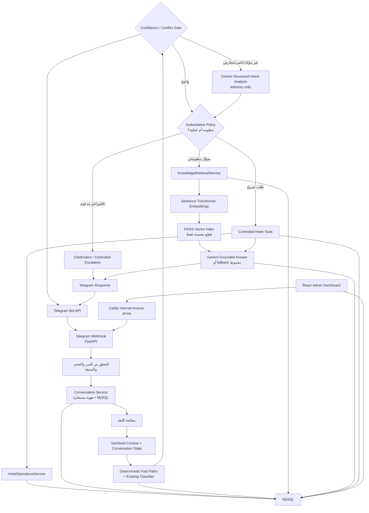
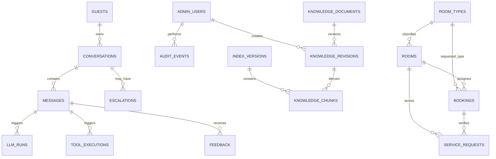

# 1. بطاقة المشروع

| البند | الوصف المثبت في المستودع |
| --- | --- |
| العنوان العربي | روبوت ذكي لدعم عملاء الفنادق باستخدام نماذج اللغة الكبيرة وتقنية استدعاء الأدوات |
| العنوان الإنكليزي | AI Hotel Customer Support Bot Using Large Language Models and Tool Calling |
| نوع المشروع | مشروع ماجستير تطبيقي يجمع هندسة البرمجيات، ومعالجة اللغة الطبيعية، والاسترجاع الدلالي، وتكامل الأنظمة |
| مجال المشكلة | دعم نزلاء فندق افتراضي وإدارة المعرفة والعمليات الخدمية المحاكية |
| المستخدمون المستهدفون | نزيل عبر Telegram، ومدير نظام (Admin)، وموظف دعم (Support)، ومقيّم (Evaluator) |
| واجهة النزيل | Telegram Bot من خلال Webhook محمي |
| الواجهة الإدارية | React 19 + TypeScript + Vite + React Router + TanStack Query |
| الخادم | Python 3.12 + FastAPI + SQLAlchemy Async + Pydantic |
| قاعدة البيانات | MySQL 8.4 بترميز `utf8mb4` وترحيلات Alembic |
| مكونات الذكاء الاصطناعي | Gemini، ومصنف Naive Bayes ثنائي اللغة، وSentence Transformers، وFAISS، والاسترجاع المعزز بالتوليد (RAG) |
| التشغيل | Docker Compose، وحاويات Backend وFrontend وMySQL، وخدمات migration/bootstrap، وخيار Prometheus |
| الفندق | فندق نور الشام الكبير، وهو فندق وبيانات تشغيلية افتراضية لأغراض المشروع |
| النسخة الموثقة | الوثيقة محدثة داخل الالتزام الذي يحتويها على `main`؛ يُثبت الالتزام المنشور بأمر `git rev-parse HEAD` ولا تُنسب تلقائياً إلى نسخة production قبل التحقق اليدوي |

مصادر الإثبات الأساسية: مصنع تطبيق FastAPI في [`backend/src/hotel_bot/main.py`](../backend/src/hotel_bot/main.py)، وتركيب Telegram الإنتاجي في [`backend/src/hotel_bot/infrastructure/telegram_runtime.py`](../backend/src/hotel_bot/infrastructure/telegram_runtime.py)، واعتماديات Backend في [`backend/pyproject.toml`](../backend/pyproject.toml)، واعتماديات Frontend في [`frontend/package.json`](../frontend/package.json)، وتشغيل Hostinger في [`compose.hostinger.yaml`](../compose.hostinger.yaml).

# 2. الملخص التنفيذي

تواجه خدمة عملاء الفنادق ثلاثة أنواع مختلفة من الطلبات: سؤال معلوماتي، أو طلب لتنفيذ عملية، أو حالة لا يستطيع النظام دعمها بأمان. الروبوت التقليدي القائم على قائمة أجوبة ثابتة لا يفهم الصياغات المتنوعة جيداً، بينما قد يهلوس نموذج لغة كبير إذا طُلب منه الإجابة من ذاكرته العامة أو تنفيذ عمليات دون قيود. يعالج المشروع هذه الفجوة بمعمارية هجينة تفصل بين الفهم، والاسترجاع، والتنفيذ، والصياغة.

يدخل النزيل من Telegram. يتحقق FastAPI أولاً من سر الـWebhook وحجم الطلب وصيغته، ثم يُحوّل هوية Telegram إلى معرّف مستعار باستخدام HMAC بدلاً من حفظ رقم المستخدم الخام. تُسجّل الرسالة ضمن محادثة في MySQL، ويُحدّد النظام اللغة والنية، ثم يفرّق بين:

- سؤال معلوماتي يجب البحث له في قاعدة المعرفة.
- طلب تشغيلي صريح يجب تمريره إلى أداة مضبوطة.
- تحية أو طلب ناقص أو حالة تتطلب توضيحاً أو تصعيداً.

بعد المسارات الحتمية الآمنة والمصنف الحالي، يطبق النظام بوابة ثقة وتعارض. لا يستدعي محلل Gemini القصدي للرسائل الواضحة، بل للحالات منخفضة الثقة أو صغيرة الهامش أو العامية أو المتعارضة بين معلومة وفعل. يعيد المحلل قراراً منظماً فقط؛ ثم تتحقق طبقة Python من النية والخانات والحالة والسياسة قبل اختيار RAG أو أداة أو سؤال توضيح. الصياغة الدفاعية الدقيقة هي: **«يساعد LLM في الفهم الدلالي للنية والسياق في الحالات غير المؤكدة أو العامية، بينما يبقى التحقق الحتمي مسؤولاً عن الصلاحيات وحالة سير العمل والتحقق من المعاملات وتنفيذ الأدوات.»**

في مسار المعرفة، لا يطلب النظام من Gemini اختراع جواب. يبحث أولاً في مستندات معتمدة ومفهرسة داخل FAISS باستخدام تضمينات دلالية (Embeddings) من نموذج Sentence Transformer متعدد اللغات. إذا كانت المطابقة الأولية ضعيفة، توجد آلية إعادة صياغة دلالية للسؤال بواسطة Gemini، ثم يُعاد البحث. عند وجود دليل كافٍ، يُطلب من Gemini صياغة جواب منظّم ومؤسس على معرّفات الأدلة المسموح بها فقط. إذا فشل Gemini بعد نجاح الاسترجاع، يعرض النظام fallback مضبوطاً من الدليل المختار ولا ينسب معلومة إلى مستند ضعيف سابق. هذا السلوك موجود في `HybridOrchestrator._knowledge` داخل [`backend/src/hotel_bot/application/llm.py`](../backend/src/hotel_bot/application/llm.py).

في مسار العمليات، لا يكتب Gemini مباشرةً في MySQL. يختار الراوتر نية تشغيلية، وتستخرج طبقة التطبيق المعاملات الموثوقة، ثم يمر الطلب إلى سجل مغلق من ست أدوات ذات مخططات Pydantic صارمة. تتولى طبقة `ControlledToolExecutor` التحقق من اسم الأداة، ودور المستدعي، وعدد الاستدعاءات، والمعاملات، والتأكيد في العمليات الكتابية، والمهلة الزمنية، ثم تسجل نتيجة منزوعة الحساسية. الأدوات الفعلية هي: عرض أنواع الغرف، وفحص التوفر، والتحقق من حجز، وإنشاء طلب خدمة غرف، وإنشاء طلب صيانة، وتتبع طلب خدمة. راجع [`backend/src/hotel_bot/application/hotel_tools.py`](../backend/src/hotel_bot/application/hotel_tools.py) و[`backend/src/hotel_bot/application/tools.py`](../backend/src/hotel_bot/application/tools.py).

يحفظ MySQL بيانات الفندق المحاكية، والمحادثات، والرسائل، وقرارات النية ضمن سجل الرسالة، وتشغيلات LLM، ومستندات المعرفة ونسخها، وإصدارات الفهرس وقطعه، وتنفيذات الأدوات، والتقييمات، وأحداث التدقيق. تعرض لوحة React هذه المعلومات وفق صلاحيات `admin` و`support` و`evaluator`. يستطيع المدير إدارة المعرفة وبيانات الفندق التجريبية، بينما يستطيع الدعم متابعة الطلبات، ويستطيع المقيّم تشغيل التقييمات وإضافة تقييم بشري.

ما يجعل المشروع أكثر من chatbot بسيط هو أن الجواب ليس مساراً واحداً: هناك حالة محادثة متعددة الأدوار، وتوجيه آمن، ومعرفة قابلة للتوسعة من لوحة الإدارة، وتنفيذ أدوات مضبوط، وتحقق ثانوي للحجوزات، وإخفاء للبيانات الحساسة، وسجل تدقيق، وتقييم قابل لإعادة الإنتاج، وتشغيل حاويات. مع ذلك، لا يرتبط المشروع بنظام إدارة فندق حقيقي (PMS)، والعمليات الحالية محاكاة، كما أن التشغيل الحي الكامل لحالات قبول RAG الثماني لم يكتمل بسبب نفاد الحصة المجانية لـ`gemini-2.5-flash`.

# 3. المشكلة التي يعالجها المشروع

## 3.1 المشكلات التشغيلية

تتكرر أسئلة النزلاء حول أوقات الدخول، والمرافق، والسياسات، والنقل، وأنواع الغرف. الرد اليدوي يستهلك وقت الاستقبال ويؤدي إلى تفاوت الإجابة بين الموظفين. كذلك تكون معرفة الفندق عادةً موزعة بين ملفات وصفحات وملاحظات، ولا يكفي البحث الحرفي عندما يسأل النزيل باللهجة أو بصياغة مرادفة.

بالتوازي، لا يريد النزيل جواباً فقط؛ فقد يريد فحص توفر أو متابعة حجز أو إنشاء طلب. هذه الإجراءات تحتاج بيانات منظمة، وتحققاً، وقيوداً، وسجلاً يمكن مراجعته. إعطاء نموذج اللغة اتصالاً مباشراً بقاعدة البيانات سيجعل قرار التنفيذ ومعاملاته خارج سيطرة التطبيق.

## 3.2 المخاطر التقنية

- **الهلوسة (Hallucination):** قد ينشئ LLM سياسة أو سعراً أو عقوبة غير موجودة.
- **سوء التوجيه:** قد تُفهم كلمة «حجز» أو «غرفة» على أنها أمر تنفيذي رغم أن السؤال عن سياسة.
- **الوصول غير المصرح:** قد يحاول مستخدم قراءة حجز أو حالة طلب من دون تحقق ثانوي.
- **تكرار العمليات:** قد يصل تحديث Telegram أكثر من مرة أو يكرر النزيل التأكيد.
- **فقدان التتبع:** من دون سجلات منفصلة لا يمكن معرفة لماذا أُجيب أو هل نُفذت أداة.
- **تعطل مزود خارجي:** Gemini وTelegram خدمتان خارجيتان قد تتأخران أو تنفد حصتهما.

## 3.3 الفصل الذي يعتمده المشروع

| نوع الطلب | القرار | مثال | أساس النتيجة |
| --- | --- | --- | --- |
| معلومات | Knowledge/RAG | هل يوفر الفندق نقلاً من المطار؟ | مستند معتمد وقطعة FAISS |
| عملية | Tool Calling | افحص غرفة لشخصين بين تاريخين | أداة محددة ومعاملات متحققة وبيانات MySQL |
| طلب ناقص | Clarification | أريد غرفة | سؤال عن أول معامل ناقص |
| تحية | Controlled response | مرحباً | نص مضبوط، بلا LLM أو أداة |
| غير مدعوم بلا دليل | Unsupported/Escalation | سؤال جوهري لا تغطيه المعرفة | إفصاح عن عدم كفاية المعلومات مع عرض التصعيد |
| خطر أو طلب موظف | Escalation | أريد موظفاً / يوجد حريق | قاعدة حتمية ذات أولوية |

التصنيف والتوجيه مثبتان في [`backend/src/hotel_bot/domain/intent/routing.py`](../backend/src/hotel_bot/domain/intent/routing.py)، بينما فصل RAG والأدوات موجود في [`backend/src/hotel_bot/application/llm.py`](../backend/src/hotel_bot/application/llm.py).

# 4. أهداف المشروع

## 4.1 الهدف العام

بناء مساعد ثنائي اللغة لخدمة نزلاء فندق افتراضي، يجيب من معرفة معتمدة وينفذ عمليات خلفية محاكية ضمن قيود قابلة للتدقيق.

## 4.2 الأهداف التقنية المنفذة

1. استقبال تحديثات Telegram الخاصة والتحقق منها.
2. تصنيف عشر نوايا عربية وإنكليزية باستخدام baseline قابل لإعادة الإنتاج.
3. التفريق العام بين طلب تنفيذ صريح وسؤال معلوماتي عبر fast paths ومصنف وبوابة ثقة ومحلل دلالي استشاري عند الحاجة فقط.
4. حفظ حالة محادثة منظمة وجمع المعاملات على عدة رسائل.
5. إدارة دورة حياة مستندات المعرفة: أب ثابت، نسخ متعددة، مسودة قابلة للتحرير، اعتماد نسخة فعالة واحدة، أرشفة، استعادة، وإعادة فهرسة.
6. بناء فهرس FAISS غير قابل للتعديل لكل إصدار، مع manifest وchecksum.
7. صياغة جواب Gemini ضمن مخطط `GroundedAnswer` والتحقق منه بعد الاستجابة.
8. تنفيذ ست أدوات محاكية ضمن allow-list ومخططات ومدد وتأكيد وتدقيق.
9. حماية البحث عن الحجز وتتبع الطلب بقيمة تحقق مخزنة كـPBKDF2 hash.
10. توفير لوحة React محمية بالأدوار وإعادة جلسة المصادقة بعد refresh.
11. تخزين السجلات التشغيلية والتقييمات في MySQL.
12. توفير Compose محلي، وCompose إنتاجي مستقل، وCompose خاص بـHostinger خلف Nginx Proxy Manager.

## 4.3 الأهداف التشغيلية المنفذة

- تخفيض الأسئلة التي تحتاج موظفاً عندما يوجد دليل معتمد.
- إرجاع طلبات ناقصة إلى مسار جمع معاملات واضح بدلاً من تنفيذ تخميني.
- جعل إنشاء خدمة الغرف والصيانة مشروطاً بالتأكيد.
- إظهار المحادثات والأدوات ونتائج التقييم للإدارة.
- الاحتفاظ بالمحادثات تشغيلياً مع سياق LLM محدود بآخر خمس دورات كاملة افتراضياً؛ وبعد 90 يوماً تُنقح نصوص الرسائل وفق مهمة الاحتفاظ، بدلاً من تمرير كل التاريخ إلى النموذج. الإعدادات في [`backend/src/hotel_bot/core/config.py`](../backend/src/hotel_bot/core/config.py)، والتنفيذ في [`backend/src/hotel_bot/application/conversations.py`](../backend/src/hotel_bot/application/conversations.py).

## 4.4 الأهداف الأكاديمية

- إثبات جدوى معمارية هجينة تجمع Intent Classification وRAG وTool Calling.
- مقارنة هدف الاسترجاع المعرفي بهدف تنفيذ العملية، وبيان اختلاف مخاطر كل منهما.
- تقديم قياسات ثابتة للمصنف والاسترجاع، وسجل تشغيلي للأدوات وLLM.
- دراسة خفض الهلوسة عبر الدليل المسموح ومخطط جواب متحقق.

## 4.5 أهداف القياس

الآثار المجمّدة الحالية تعرض:

- دقة intent مقدارها `0.875` على 80 عينة اختبار، وMacro-F1 مقدارها `0.8728`، وتغطية `0.975`؛ راجع [`backend/artifacts/evaluation/intent-evaluation-v1.json`](../backend/artifacts/evaluation/intent-evaluation-v1.json).
- تقرير استرجاع offline على 44 حالة: Recall@5=`0.9773`، وTop-1 Accuracy=`0.8409`، وMRR=`0.8871`، وTraceability=`1.0`؛ لكنه يستخدم `hashing-test-v1:384` كاختبار حتمي، وليس دليلاً منفرداً على أداء Sentence Transformer الإنتاجي. راجع [`backend/reports/knowledge-retrieval-v1.json`](../backend/reports/knowledge-retrieval-v1.json).

## 4.6 أهداف مستقبلية غير منفذة

الربط مع PMS حقيقي، والحجز والدفع الحقيقيان، وتجربة ميدانية على نزلاء حقيقيين، والـreranking، والبحث الهجين، والأدوار الدقيقة داخل كل قسم، واختبارات حمل موسعة؛ لا يجوز عرضها كميزات حالية.

# 5. نطاق المشروع

## 5.1 ما يتضمنه

- Telegram كنقطة دخول للنزيل.
- العربية والإنكليزية.
- معلومات الفندق من مستندات معتمدة.
- أنواع غرف ومخزون وحجوزات وطلبات خدمة محاكية مخزنة في MySQL.
- فحص توفر حسب التواريخ والسعة والحجوزات المتقاطعة والحالة التشغيلية للغرف.
- بحث آمن عن الحجز بقيمة تحقق.
- إنشاء خدمة غرف وصيانة وتتبع طلب مرتبط بحجز متحقق.
- إدارة المعرفة والفندق والمحادثات والطلبات والتقييمات.
- سجلات LLM والأدوات والتدقيق.
- نشر حاويات وhealth checks وتهيئة reverse proxy.

## 5.2 ما لا يتضمنه

- لا يوجد اتصال مثبت مع PMS مثل Opera أو Mews أو Cloudbeds.
- لا ينشئ النظام حجزاً حقيقياً للنزيل من Telegram؛ أداة التوفر للقراءة فقط.
- لا توجد بوابة دفع أو تسوية مالية.
- لا يرسل طلب خدمة إلى موظف أو جهاز فعلي خارج قاعدة المشروع.
- لا يقدم استشارة قانونية ولا يختلق عقوبة غير موثقة.
- لا توجد واجهة ويب مستقلة للنزيل؛ الواجهة الحالية Telegram فقط.
- لا يوجد إثبات داخل المستودع على pilot مع فندق أو مستخدمين حقيقيين.

## 5.3 ما هو production-like وما هو تجريبي

| الجزء | التوصيف الصادق |
| --- | --- |
| المصادقة، RBAC، hashing، redaction، audit | ضوابط برمجية production-like ومغطاة باختبارات |
| MySQL وAlembic والمعاملات | بنية فعلية وليست مخزناً داخل الذاكرة |
| FAISS وSentence Transformer | تركيب إنتاجي فعلي، مع اختبار offline حتمي واختبار حي opt-in |
| Gemini وTelegram | تكاملان فعليان لكنهما يعتمدان على أسرار وشبكة وحصة خارجية |
| الفندق والغرف والحجوزات | بيانات عرض مصطنعة ومعلّمة كمحاكاة |
| Service Requests | سجلات MySQL فعلية داخل المشروع، لكنها لا تصل إلى نظام تشغيل فندق خارجي |
| Compose وhealth checks | إعداد نشر فعلي؛ لا يثبت وحده أن النسخة الحالية منشورة ومتحققة يدوياً |

مصدر البيانات التجريبية هو [`backend/src/hotel_bot/seed/data/nour-al-sham-v1.json`](../backend/src/hotel_bot/seed/data/nour-al-sham-v1.json)، وتصرح مخرجات الأدوات بالحقل `simulation: true` في [`backend/src/hotel_bot/application/hotel_tools.py`](../backend/src/hotel_bot/application/hotel_tools.py).

# 6. المستخدمون والأدوار

| الطرف | دوره | ما يستطيع فعله | حدود الصلاحية |
| --- | --- | --- | --- |
| النزيل | مستخدم Telegram | السؤال، فحص التوفر، التحقق من حجز، إنشاء طلب بعد التأكيد، تتبع طلب | لا يصل إلى MySQL أو اسم أداة مباشرة |
| Admin | مدير المنصة | جميع شاشات الإدارة، المعرفة، Hotel Data، الطلبات، التقييمات | Bearer token قصير العمر ودور `admin` |
| Support | موظف دعم | المحادثات وطلبات الخدمة وتغيير حالاتها | لا يدير المعرفة أو Hotel Data |
| Evaluator | مقيّم | المحادثات، feedback، وتشغيل/عرض التقييم | لا يدير العمليات أو المعرفة |
| Gemini | مزود ذكاء اصطناعي خارجي | إعادة صياغة بحث وصياغة جواب من دليل/نتيجة أداة | غير مخوّل بالوصول المباشر لقاعدة البيانات |
| MySQL | خدمة بيانات | يحفظ الحالة والآثار والبيانات التشغيلية | غير منشور كمنفذ عام في Hostinger |
| FAISS/Sentence Transformer | خدمة استرجاع داخل Backend | تضمين وبحث عن القطع | لا يعتمد مستنداً ولا ينفذ عملية |
| Nginx Proxy Manager | بوابة VPS القائمة | النطاق وTLS والتوجيه إلى frontend | خارج المشروع ولا يديره Compose الخاص بالمشروع |

الأدوار معرفة في [`backend/src/hotel_bot/persistence/enums.py`](../backend/src/hotel_bot/persistence/enums.py)، وتوزيع المسارات في [`backend/src/hotel_bot/api/routes/admin.py`](../backend/src/hotel_bot/api/routes/admin.py) و[`frontend/src/App.tsx`](../frontend/src/App.tsx).

# 7. المعمارية العامة



ملاحظة: السهم من React إلى MySQL في الرسم منطقي عبر API وليس اتصالاً مباشراً؛ المتصفح يتعامل مع `/api/v1/admin/*` فقط، وCaddy يمرر `/api/*` إلى `backend:8000` وفق [`frontend/app-routes.caddy`](../frontend/app-routes.caddy).

## 7.1 شرح المكونات

1. **Telegram Webhook:** مسار `POST /api/v1/telegram/webhook` يتحقق من `X-Telegram-Bot-Api-Secret-Token` بمقارنة constant-time، ومن `Content-Type` والحجم وPydantic schema. المصدر: [`backend/src/hotel_bot/api/routes/telegram.py`](../backend/src/hotel_bot/api/routes/telegram.py).
2. **FastAPI:** ينشئ `DatabaseManager` و`AdminApplicationRuntime` و`TelegramApplicationRuntime` في lifespan، ويضيف trusted hosts وsecurity headers وcorrelation وobservability. المصدر: [`backend/src/hotel_bot/main.py`](../backend/src/hotel_bot/main.py).
3. **اللغة:** parser يفضل نصاً عربياً أو لاتينياً واضحاً، ويدعم `/ar` و`/en`. تحفظ اللغة المفضلة مع الضيف والمحادثة. المصدر: [`backend/src/hotel_bot/application/telegram.py`](../backend/src/hotel_bot/application/telegram.py) و[`backend/src/hotel_bot/infrastructure/repositories/conversations.py`](../backend/src/hotel_bot/infrastructure/repositories/conversations.py).
4. **Intent Routing:** مصنف Naive Bayes مدرب على dataset ثنائي اللغة، تحيط به fast paths وقواعد أمان وتمييز action-vs-information، ثم `HybridIntentRoutingService` ذات بوابة ثقة وتعارض تستشير Gemini عند الحاجة فقط. القرار المنظم استشاري، وتبقى طبقة التطبيق authoritative. المصدر: [`backend/src/hotel_bot/domain/intent/classifier.py`](../backend/src/hotel_bot/domain/intent/classifier.py)، [`backend/src/hotel_bot/domain/intent/routing.py`](../backend/src/hotel_bot/domain/intent/routing.py)، و[`backend/src/hotel_bot/application/intent_routing.py`](../backend/src/hotel_bot/application/intent_routing.py).
5. **Conversation State:** Pydantic model محدود الحقول يخزن التواريخ والعدد والغرفة والفئة والـworkflow، ولا يخزن رمز التحقق. المصدر: [`backend/src/hotel_bot/domain/conversation/models.py`](../backend/src/hotel_bot/domain/conversation/models.py).
6. **RAG:** المستندات المعتمدة تُجزأ وتُضمن وتُفهرس، ثم يعاد تكوين الأدلة من metadata في MySQL. المصدر: [`backend/src/hotel_bot/application/knowledge.py`](../backend/src/hotel_bot/application/knowledge.py).
7. **FAISS:** يستخدم `IndexFlatIP` بعد L2 normalization، أي تشابه cosine فعلياً، مع manifest وchecksum. المصدر: [`backend/src/hotel_bot/infrastructure/faiss_store.py`](../backend/src/hotel_bot/infrastructure/faiss_store.py).
8. **Gemini:** adapter يوقف automatic function calling ويطلب JSON schema عند الحاجة. يستخدم للتحليل القصدي المقيد، وإعادة صياغة البحث عند غياب query من المحلل، وصياغة الجواب، ولا يملك صلاحية تنفيذ أداة. المصدر: [`backend/src/hotel_bot/infrastructure/gemini.py`](../backend/src/hotel_bot/infrastructure/gemini.py).
9. **الأدوات:** سجل مغلق من ست أدوات، والتحقق والتنفيذ خارج LLM. المصدر: [`backend/src/hotel_bot/application/hotel_tools.py`](../backend/src/hotel_bot/application/hotel_tools.py).
10. **MySQL:** 19 جدولاً رئيسياً حسب SQLAlchemy metadata، مع Alembic وترابطات وقيود. المصدر: [`backend/src/hotel_bot/persistence/models.py`](../backend/src/hotel_bot/persistence/models.py).
11. **React Admin:** مسارات محمية ودور لكل شاشة، وجلسة مخزنة في `sessionStorage` وتُعاد مصادقتها من الخادم بعد refresh. المصدر: [`frontend/src/App.tsx`](../frontend/src/App.tsx) و[`frontend/src/auth/AuthContext.tsx`](../frontend/src/auth/AuthContext.tsx).
12. **Docker/Proxy:** Hostinger ينشر frontend فقط افتراضياً على `8088`، ويبقي backend وMySQL داخليين؛ Nginx Proxy Manager الخارجي يتولى TLS. المصدر: [`compose.hostinger.yaml`](../compose.hostinger.yaml) و[`ops/deployment.md`](../ops/deployment.md).

# 8. مسار معالجة الرسالة

1. **وصول Webhook:** FastAPI يستقبل JSON ويمنع الطلب إذا كان runtime غير مهيأ، أو السر خاطئاً، أو payload كبيراً أو غير صالح.
2. **تحويل التحديث:** `parse_telegram_update` يقبل رسالة نصية غير فارغة في private chat من مستخدم غير bot؛ التحديثات الأخرى تُهمل بأمان. الأزرار inline تُقرأ بمسار callback مستقل.
3. **تحديد اللغة:** `_language` يفحص script الرسالة وmetadata؛ أوامر `/ar` و`/en` اختيار صريح. في الرسائل اللاحقة تُستخدم اللغة المفضلة المحفوظة ما لم يغيرها الأمر.
4. **تعريف الضيف والمحادثة:** `telegram_identity_hash` ينشئ HMAC-SHA256 من user ID وpepper. `ConversationService.record_inbound` يحجز `channel_updates` لمنع التكرار ثم يجد محادثة مفتوحة حديثة أو ينشئ واحدة.
5. **تجميع السياق:** `assemble_context` يحتفظ بالحالة والرسالة الحالية ثم الأدلة والملخص وآخر خمس دورات مكتملة ضمن token budget. الرسائل المنقحة والدورات الناقصة لا تدخل.
6. **استخراج المعاملات:** `extract_parameters` يقرأ تواريخ ISO، وعدد البالغين/الأطفال، ومرجع الحجز، ورمز التتبع، ورقم الغرفة، وقيمة التحقق، والفئة والوصف والاستعجال.
7. **حماية السر:** إذا وُجد رمز تحقق، تُنقح الرسالة المخزنة إلى `[redacted:verification]`. وقبل أي LLM، تنقح `sanitize_context` الرسالة والملخص والدورات الواردة والصادرة، ولا يحمل محلل النية سوى markers مثل `BOOKING_REFERENCE_PRESENT` و`VERIFICATION_VALUE_REDACTED`.
8. **المسارات السريعة:** الأوامر والأزرار، والرد القصير المتوقع في workflow، ومرجع `BKG` أو `SR` المنظم، وطلب التوفر الكامل، والتحية/السلامة الواضحة لا تستدعي محلل النية.
9. **المصنف والبوابة:** يستدعي `IntentRoutingService` المصنف الحالي، ثم تفحص `HybridIntentRoutingService` الثقة والهامش وتعارض الفعل/المعلومة والعامية والغموض وتغير الموضوع أثناء workflow.
10. **التحليل الاختياري:** عند تحقق البوابة فقط، يعيد Gemini عقد `HybridIntentDecision` منظماً. الحد الأقصى محاولة تحليل واحدة لكل message ID مع timeout وذاكرة مؤقتة آمنة لا تحتوي قيماً حساسة. الإخفاق ينتج سؤال توضيح مضبوطاً ولا يخمن أداة.
11. **القرار authoritative:** تتحقق Python من intent المسموح والخانات والحالة والتأكيد والسياسات. لا يقبل التطبيق اسم أداة من المحلل؛ بل يشتق الأداة لاحقاً من النية المعتمدة.
12. **قرار RAG أو Tool:** `HybridOrchestrator.handle` يرسل `KNOWLEDGE_CANDIDATE` إلى `_knowledge` و`ACTION_CANDIDATE` إلى `_action`. حالات clarification/escalation/greeting تعالج بنص مضبوط.
13. **RAG:** الاستعلام يضمّن، وFAISS يرجع عدة مرشحين، ثم يطبق تحقق صلة عام يجمع score والتداخل الدلالي/اللفظي وتغطية الشروط. إذا قدم المحلل query صالحاً يعاد استخدامه بلا نداء rewrite؛ وإلا قد تحصل إعادة صياغة واحدة عندما يكون أقوى score أقل من `0.55`.
14. **Tool Calling:** يُحدد اسم الأداة حتمياً من النية، وتُمرر معاملات allow-listed مستخرجة محلياً، وتتحقق Pydantic/domain policies والتأكيد قبل التنفيذ.
15. **صياغة الجواب:** Gemini يرجع `GroundedAnswer`؛ التطبيق يعيد التحقق من basis ومعرفات الدليل أو أسماء الأدوات. عند فشله، يوجد fallback من نفس مجموعة الأدلة النهائية المتحققة أو نتيجة الأداة المتحققة.
16. **تحديث الحالة:** عند نجاح أداة تُغلق العملية النشطة. في خطأ تواريخ التوفر تمسح الخانات الخاطئة فقط للمحاولة التالية. خدمة الغرف والصيانة تمسح حقولها بعد النجاح أو الإلغاء.
17. **التسجيل:** تحفظ الرسالة، وintent/confidence/classifier version، وLLM run، وtool execution، وcorrelation ID في MySQL، وتكتب طبقة hybrid metadata آمنة عن المصدر والقرار وسبب fallback دون النص أو الأسرار.
18. **الإرسال:** يسجل الرد outbound ثم يرسله `TelegramBotAPIClient`. إذا تجاوز 4096 حرفاً أو فشل التسليم، يُعاد خطأ يسمح لـTelegram بإعادة المحاولة.

المسار الجامع هو `HotelGuestProcessor._process_message` و`_respond_to_guest` في [`backend/src/hotel_bot/application/guest_flows.py`](../backend/src/hotel_bot/application/guest_flows.py)، وتركيبه الفعلي في `TelegramApplicationRuntime.handle` داخل [`backend/src/hotel_bot/infrastructure/telegram_runtime.py`](../backend/src/hotel_bot/infrastructure/telegram_runtime.py).

# 9. الفرق بين RAG وTool Calling

| البعد | الاسترجاع المعزز بالتوليد (RAG) | استدعاء الأدوات (Tool Calling) |
| --- | --- | --- |
| الهدف | جواب معلوماتي موثق | قراءة/كتابة عملية فندقية محددة |
| المدخل | سؤال طبيعي | نية تشغيلية ومعاملات منظمة |
| المصدر | مستندات معتمدة وFAISS | MySQL وسياسات المجال |
| المخرج | `GroundedAnswer` مع `evidence_ids` | نتيجة أداة متحققة ثم `GroundedAnswer` مع `tool_names` |
| متى يُختار | سؤال سياسة/شرط/مرفق/موعد/سعر أو سؤال جوهري ملتبس | طلب صريح للفحص أو المتابعة أو الإنشاء أو التتبع |
| هل يغير البيانات؟ | لا | أداتا خدمة الغرف والصيانة تغيران البيانات؛ البقية قراءة |
| الخطر الأساسي | دليل غير ذي صلة أو جواب غير مؤسس | تنفيذ غير مصرح أو بمعاملات خاطئة أو مكرر |
| التحقق | score threshold، مستند معتمد، allow-list للأدلة، JSON schema | سجل أدوات مغلق، Pydantic، role/call limit، confirmation، domain rules |
| التدقيق | `knowledge_chunks` و`llm_runs` ومعرفات evidence في الجواب | `tool_executions` بمعاملات ونتائج منزوعة الحساسية |
| مثال | Does the hotel provide airport transfer? | Check availability from 2026-08-10 to 2026-08-12 |
| مثال | ما الوثائق المطلوبة؟ | تابع الحجز `BKG-2026-0001` |
| مثال | ما سياسة الفندق؟ | أنشئ خدمة غرف أو صيانة، أو تابع طلب خدمة |

القاعدة التي يجب قولها في المناقشة: **RAG يقرر ماذا نعرف من محتوى معتمد، أما Tool Calling فينفذ ما سمح به التطبيق بعد تحقق من النوع والمعاملات والسياسة.**

# 10. نظام Intent Routing

## 10.1 التصنيف القصدي

التصنيف يحتوي عشر نوايا في [`backend/src/hotel_bot/domain/intent/enums.py`](../backend/src/hotel_bot/domain/intent/enums.py):

1. `hotel_info`
2. `room_types`
3. `room_availability`
4. `booking_lookup`
5. `room_service_request`
6. `maintenance_request`
7. `service_request_status`
8. `human_escalation`
9. `greeting_smalltalk`
10. `unsupported`

المصنف baseline هو Multinomial Naive Bayes يعتمد word/word-bigram/character features ويُدرّب وقت تكوين runtime على split التدريب من dataset ثابت. توجد lexicon boosts صغيرة، لكن المصنف لا ينفذ أداة؛ `SafeIntentRouter` يقرر المسار النهائي. المصدر: [`backend/src/hotel_bot/domain/intent/classifier.py`](../backend/src/hotel_bot/domain/intent/classifier.py).

## 10.2 النوايا التشغيلية

`room_availability` و`booking_lookup` و`room_service_request` و`maintenance_request` و`service_request_status` و`room_types` مرتبطة بأدوات. لكن كون المصنف اقترح نية تشغيلية لا يكفي. `_is_explicit_action` يطلب دليلاً عاماً على الفعل:

- التوفر: تواريخ أو طلب بحث/حجز غرفة أو سؤال توفر صريح.
- البحث عن حجز: booking reference أو تعبير عن «حجزي الحالي/متابعة حجزي».
- خدمة الغرف: طلب فعل لا سؤال معلومات، أو room-service expression مع رقم غرفة.
- الصيانة: وصف مشكلة تشغيلية مثل عطل أو كسر أو تسريب.
- تتبع الطلب: tracking code أو طلب تتبع واضح.
- أنواع الغرف: طلب عرض الفئات.

## 10.3 الأسئلة المعلوماتية

إذا توقع المصنف نية تشغيلية لكن لا يوجد فعل صريح وكانت الرسالة سؤالاً جوهرياً، يحول الراوتر التنبؤ إلى `hotel_info` وقرار `KNOWLEDGE_CANDIDATE` بسبب `informational_or_ambiguous_knowledge_candidate`. لذلك:

- «هل تسمحون بحجز غرفة لشاب وفتاة غير متزوجين؟» ليست فحص توفر.
- «ما شروط حجز الغرفة؟» ليست عملية.
- «هل يلزم إبراز وثيقة؟» ليست بحث حجز.
- «هل يوفر الفندق خدمة نقل من المطار؟» ليست أداة نقل؛ لا توجد أداة نقل أصلاً.

## 10.4 التحية وعدم الدعم والتصعيد

- التحية الصافية فقط تحصل على `CONTROLLED_RESPONSE`.
- سؤال جوهري صُنّف `greeting_smalltalk` أو `unsupported` لا يعود إلى welcome؛ يجرب knowledge.
- طلب إنسان أو عبارات خطر محددة تتقدم إلى `ESCALATE`.
- إذا لم يوجد دليل كافٍ، يرجع `UNAVAILABLE` صريحاً ويعرض التصعيد.

## 10.5 أولوية workflow النشط

عندما يكون `active_workflow` موجوداً، يعاد بناء routing حتمي للنية الحالية. الردود المتوقعة المنظمة أو القصيرة، مثل `101` عند انتظار رقم غرفة أو قيمة تحقق عند انتظارها، تتجاوز محلل Gemini وتملأ الخانة مباشرة. إذا كانت الرسالة سؤالاً جوهرياً واضحاً لا يشبه الخانة المنتظرة، تسمح بوابة السياق بتحليل تغير الموضوع؛ وعند قرار Knowledge موثوق يُغلق workflow السابق، بينما يحافظ فشل المزود أو الغموض على الحالة ويسأل توضيحاً. يمكن الإلغاء بكلمة/زر cancel، ويُغلق workflow بعد نجاح الأداة.

## 10.6 بوابة الثقة ومحلل السياق

يستدعى `HybridIntentRoutingService` فقط عند واحدة أو أكثر من الحالات العامة: سبب توجيه متعارض بين معلومة وفعل، أو ثقة أقل من `HYBRID_LLM_ROUTER_CONFIDENCE_THRESHOLD`، أو هامش أصغر من عتبة المصنف، أو سؤال معلوماتي قصير قابل لأكثر من معنى، أو تغير موضوع محتمل أثناء workflow. أما الأوامر، والتحية/السلامة الواضحة، والـworkflow reply المتوقع، و`BKG`/`SR` المنظم، وطلب التوفر المكتمل، والتصنيف عالي الثقة غير المتعارض فتتجاوز المحلل.

العقد `HybridIntentDecision` يقبل فقط:

- `mode`: إحدى `action`, `knowledge`, `ambiguous`, `unsupported`.
- `intent`: نية موجودة في enum أو `null` وفق mode.
- `confidence` و`language`.
- `entities` غير حساسة ومقيدة، مثل الغرفة والتواريخ والعدد والفئة ووصف الخدمة.
- `missing_fields`, `needs_clarification`, و`clarification_question`.
- `normalized_knowledge_query` و`material_conditions`.

أي حقل إضافي، أو intent مجهول، أو محاولة تمرير tool أو query قاعدة بيانات، أو لغة غير لغة الرسالة، أو JSON غير صالح يرفض. المحلل **لا ينفذ**؛ القرار النهائي يعاد بناؤه كـ`RoutingResult` وتُحسب الخانات المطلوبة من taxonomy لا من ادعاء النموذج. الإعدادات هي `HYBRID_LLM_ROUTER_ENABLED`, `HYBRID_LLM_ROUTER_CONFIDENCE_THRESHOLD`, و`HYBRID_LLM_ROUTER_TIMEOUT_SECONDS`.

عدم استدعاء المحلل لكل رسالة قرار مقصود: يخفض latency والكلفة والحصة، ويحافظ على سلوك حتمي قابل للاختبار للأوامر والمعرّفات والخانات المنظمة. المقابل هو اعتماد خارجي إضافي فقط في الرسائل الصعبة؛ فائدته فهم اللهجة والطلبات غير المباشرة وتمييز الفعل من المعلومة، وحدوده timeout وquota واحتمال قرار غير صالح، ولذلك تبقى طبقة السياسة الحتمية حاجز الأمان.

## 10.7 قابلية توسيع المعرفة

لا يضيف المطور rule لكل موضوع مستند. أي سؤال معلوماتي جوهري يمر إلى البحث في **جميع القطع الناتجة من النسخ المعتمدة في الفهرس النشط**. لذلك يستطيع Admin إضافة موضوع مستقبلي واعتماده وإعادة بناء FAISS، ثم يصبح قابلاً للوصول دلالياً دون alias خاص. اختبار القبول الحي opt-in ينشئ موضوع مظلة مؤقتاً لإثبات الفكرة في [`backend/tests/integration/test_production_rag_acceptance.py`](../backend/tests/integration/test_production_rag_acceptance.py)، لكن التشغيل الكامل الحي Tests 1–8 لم يكتمل بسبب نفاد حصة Gemini المجانية، ولا يُدعى هنا أنه نجح.

اختبارات التوجيه المحلية التي تدعم الفصل موجودة في [`backend/tests/unit/domain/test_intent_pipeline.py`](../backend/tests/unit/domain/test_intent_pipeline.py)، واختبارات بوابة الثقة والعقد والفشل والخصوصية في [`backend/tests/unit/domain/test_hybrid_intent_routing.py`](../backend/tests/unit/domain/test_hybrid_intent_routing.py). أما الاختبارات التي تثبت relevance validation وfallback بعد rewritten retrieval دون شبكة ففي [`backend/tests/unit/domain/test_llm_orchestration.py`](../backend/tests/unit/domain/test_llm_orchestration.py).

# 11. حالة المحادثة (Conversation State)

## 11.1 لماذا نحتاج الحالة؟

لا يرسل النزيل دائماً جميع البيانات في جملة واحدة. قد يقول «أريد غرفة»، ثم يرسل تاريخ الوصول، ثم المغادرة، ثم العدد. `ConversationState` يحفظ فقط الخانات التشغيلية المحددة:

- `language`
- `check_in` و`check_out`
- `adults` و`children`
- `room_type_code`
- `masked_booking_reference`
- `room_number`
- `service_category` و`service_description`
- `active_request_tracking_code`
- `active_workflow`

النموذج يمنع الحقول الإضافية ويضع حدوداً للأطوال والأعداد. لا يحتوي قيمة تحقق أو نصاً حراً غير محدود. راجع [`backend/src/hotel_bot/domain/conversation/models.py`](../backend/src/hotel_bot/domain/conversation/models.py).

## 11.2 الـworkflows والمعاملات

| Workflow | النية | المعاملات المطلوبة |
| --- | --- | --- |
| `availability` | `room_availability` | `check_in`, `check_out`, `adults` |
| `booking_lookup` | `booking_lookup` | `booking_reference`, `verification_value` |
| `room_service` | `room_service_request` | `room_number`, `category`, `description` |
| `maintenance` | `maintenance_request` | `room_number`, `description`، وقد تُطلب category إذا لم تُستنتج |
| `request_status` | `service_request_status` | `tracking_code`, `verification_value` |

ترتيب المتطلبات authoritative في [`backend/src/hotel_bot/domain/intent/taxonomy.py`](../backend/src/hotel_bot/domain/intent/taxonomy.py). يسأل orchestrator عن أول معامل ناقص فقط عبر `INTENT_PARAMETER_QUESTIONS` في [`backend/src/hotel_bot/application/llm.py`](../backend/src/hotel_bot/application/llm.py).

## 11.3 منع الحلقات

- بعد بدء workflow، يُجبر routing على النية الحالية بدلاً من إعادة تصنيف الرد القصير.
- تُدمج الخانات الجديدة مع الحالة السابقة.
- يسأل النظام سؤالاً واحداً خاصاً بالـworkflow، لا قائمة عامة متكررة.
- عند خطأ تاريخ الوصول تُمسح التواريخ المتأثرة فقط وتبقى السعة المجموعة.
- بعد نجاح الأداة يُمسح `active_workflow`.
- بعد نجاح أو إلغاء خدمة الغرف/الصيانة تُمسح الغرفة والفئة والوصف.
- الأزرار المنتهية تعطي جواباً مضبوطاً بدلاً من تنفيذ جديد.
- `idempotency_key` مشتق من message ID، فيمنع تكرار إنشاء الطلب نفسه.

توجد اختبارات صريحة لعدم تكرار الرحلات في [`backend/tests/integration/test_demo_acceptance_flows.py`](../backend/tests/integration/test_demo_acceptance_flows.py)، ولاستخراج الخانات في [`backend/tests/unit/domain/test_guest_flow_parameters.py`](../backend/tests/unit/domain/test_guest_flow_parameters.py).

## 11.4 أمر `/new`

يمرر `/new` القيمة `force_new_conversation=True`. يغلق repository المحادثات المفتوحة السابقة ويبدأ محادثة وحالة جديدتين. لا يحذف التاريخ؛ بل يفصل السياق الجديد عن السابق. المصدر: `ConversationService.record_inbound` و`SQLAlchemyConversationRepository.get_or_start_conversation` في [`backend/src/hotel_bot/application/conversations.py`](../backend/src/hotel_bot/application/conversations.py) و[`backend/src/hotel_bot/infrastructure/repositories/conversations.py`](../backend/src/hotel_bot/infrastructure/repositories/conversations.py).

## 11.5 مثال متعدد الرسائل

| الدور | الرسالة | الحالة/القرار |
| --- | --- | --- |
| النزيل | أريد غرفة | يبدأ `availability`، ويسأل عن الوصول |
| الروبوت | ما تاريخ الوصول؟ | لا أداة |
| النزيل | 2026-08-10 | يحفظ `check_in` ويسأل المغادرة |
| الروبوت | ما تاريخ المغادرة؟ | لا أداة |
| النزيل | 2026-08-12 | يحفظ `check_out` ويسأل عدد البالغين |
| الروبوت | كم عدد البالغين؟ | لا أداة |
| النزيل | شخصين | يستخرج `adults=2` |
| النظام | ينفذ `check_room_availability` | يطبق حد 30 ليلة، و365 يوماً، والسعة، والتداخل |
| الروبوت | يعرض أول خيار متاح أو عدم التوفر | يغلق workflow؛ الجواب من نتيجة أداة متحققة |

البحث عن حجز يعمل بالطريقة نفسها لكن قيمة التحقق تُنقح فوراً ولا تدخل حالة المحادثة. أما إنشاء خدمة الغرف والصيانة فيضيف خطوة confirmation قبل الكتابة.

# 12. الاسترجاع المعزز بالتوليد (RAG) بالتفصيل

## 12.1 دورة الحياة الفعلية

1. ينشئ Admin رأس مستند ثابتاً في `knowledge_documents` ونسخة أولى في `knowledge_revisions`؛ لا تمثل النسخة الجديدة مستنداً مكرراً.
2. النسخة الجديدة تبدأ كمسودة لأنها لا تحمل حدث اعتماد في `audit_events` ولا يساوي معرّفها `current_revision_id`.
3. يمكن تعديل المسودة نفسها حتى الاعتماد؛ أما النسخة الفعالة أو نسخة سبق اعتمادها فهي immutable وتبقى للقراءة التاريخية.
4. عند الاعتماد يصبح `current_revision_id` هو معرّف النسخة المختارة وتكون حالة الأب `approved`. هذا هو التعريف الوحيد للنسخة الفعالة، لذلك لا توجد نسختان فعالتان معاً.
5. النسخ الأخرى التي لها حدث اعتماد تصبح historical، والنسخ غير المعتمدة تبقى draft. لا حاجة إلى migration لأن المخطط الحالي مع سجل التدقيق يحمل هذه الدلالة.
6. الاعتماد، وإعادة اعتماد نسخة سابقة، والأرشفة، والاستعادة تطلق مزامنة FAISS في الخلفية. إنشاء/تحرير مسودة لا يغير corpus الفعال ولا يحتاج بناءاً.
7. `list_approved_revisions` يجلب فقط `current_revision_id` لمستندات الأب ذات الحالة `approved`; لذلك draft وhistorical وarchived مستبعدة.
8. `chunk_text` ينظف النص ويجزئه بحد 800 حرف وتداخل 120 افتراضياً، وتحمل القطعة `document_id`, `revision_id`, `revision_version`, `title`, `language` وmetadata قابلة للتتبع.
9. نص التضمين هو `title + newline + chunk text`، وSentence Transformer ينتج متجهاً 384 بعد normalization.
10. FAISS يبني `IndexFlatIP` ويحفظ `index.faiss` و`manifest.json` وchecksum في مجلد immutable مؤقت ثم ينشره ذرياً.
11. قبل التفعيل يقارن repository مجموعة revision IDs المبنية بالمجموعة الفعالة الحالية في MySQL؛ إذا تغيرت دورة الحياة أثناء البناء يرفض الإصدار كـ`index_build_stale` ولا يجعله active.
12. بعد التحقق من artifact، تُخزن القطع في MySQL ويصبح الإصدار `active` وتنتقل النسخة النشطة السابقة إلى `retired`. إذا لم يبق أي مستند مؤهل، يُحال الفهرس النشط إلى retired بدلاً من نشر فهرس فارغ مضلل.
13. عند السؤال يُضمّن query، ويبحث FAISS في ما يصل إلى `top_k*3` ثم يرشح ما دون `0.35` ويعيد عدة مرشحين مؤهلين فقط.
14. إذا كان أقوى score أقل من `0.55` ولم يعطِ محلل النية query منظماً، يمكن إعادة صياغة السؤال مرة واحدة، ثم تتحقق الصلة المادية قبل قبول أي قطعة.
15. إذا كان الاسترجاع النهائي كافياً، يرسل الأدلة مع معرفاتها إلى prompt ويقبل Gemini فقط إذا أعاد `basis=knowledge` ومعرفات ضمن allow-list، ثم يسجل `llm_runs` وmetadata التشغيلية.

التنفيذ في [`backend/src/hotel_bot/application/knowledge.py`](../backend/src/hotel_bot/application/knowledge.py)، و[`backend/src/hotel_bot/infrastructure/repositories/knowledge.py`](../backend/src/hotel_bot/infrastructure/repositories/knowledge.py)، و[`backend/src/hotel_bot/infrastructure/faiss_store.py`](../backend/src/hotel_bot/infrastructure/faiss_store.py).

## 12.2 الأب والنسخ والاعتماد

حالة الأب مستقلة عن حالة النسخة. الأب `approved` يجعل نسخته الحالية مؤهلة، والأب `archived` يمنع جميع نسخه حتى لو بقيت النسخة الحالية موصوفة بأنها approved في التاريخ. يعتمد Admin مسودة جديدة لتصبح الفعالة، أو يعيد اعتماد نسخة historical عبر إجراء **اعتماد هذه النسخة** مع confirmation؛ لا يحذف ذلك أي نسخة أحدث. يبدأ rebuild تلقائياً، وتظهر الواجهة `building` أو `needs_rebuild` إلى أن تتطابق revision IDs في الفهرس النشط مع MySQL. يبقى زر **إعادة بناء FAISS** إجراءً صريحاً للتعافي أو التشغيل اليدوي. يغطي ذلك [`backend/tests/integration/test_knowledge_versioning.py`](../backend/tests/integration/test_knowledge_versioning.py).

## 12.3 التمثيل والعتبة

الإعدادات الافتراضية:

| الإعداد | القيمة |
| --- | --- |
| Embedding model | `sentence-transformers/paraphrase-multilingual-MiniLM-L12-v2` |
| Revision | `86741b4e3f5cb7765a600d3a3d55a0f6a6cb443d` |
| Dimension | 384 |
| Chunk max | 800 حرف |
| Chunk overlap | 120 حرف |
| Top K | 5 |
| Minimum score | 0.35 |
| Rewrite trigger | 0.55 |

المصدر: [`backend/src/hotel_bot/core/config.py`](../backend/src/hotel_bot/core/config.py) والثابت في [`backend/src/hotel_bot/application/llm.py`](../backend/src/hotel_bot/application/llm.py).

بعد عتبة FAISS، لا يعتمد النظام top-one آلياً لمجرد أنه الأعلى: يحافظ على عدة مرشحين ومعرّفات المستند والنسخة والقطعة ورقم النسخة والعنوان واللغة والـscore والـmetadata، ثم يعيد ترتيبها بصورة عامة وفق تغطية `material_conditions` والتداخل المادي غير العام والدرجة الدلالية. تُستبعد مفردات الفندق العامة مثل room/booking/service/policy من إثبات الصلة؛ والقطعة التي لا تتقاطع مع query أو أي شرط تُرفض حتى لو كان score مرتفعاً. لا توجد كلمات إنتاجية خاصة بالزواج أو الحيوانات أو المطار أو عنوان مستند بعينه. تستخدم صياغة الجواب وfallback مجموعة الأدلة النهائية المتحققة نفسها؛ لذلك غياب السياسة المختلطة لا يسمح باستخدام Pet Policy.

## 12.4 إعادة الصياغة الدلالية

إعادة الصياغة ليست جواباً وليست قاعدة موضوع. إذا أنتج محلل النية `normalized_knowledge_query` صالحاً مع `material_conditions`، يعيد RAG استخدامه مباشرةً ولا ينفذ `knowledge_query_rewrite` ثانية للرسالة نفسها. إذا لم ينتجه وكانت المطابقة الأولية ضعيفة فقط، يطلب `KnowledgeSearchQuery` حقول `language`, `query`, و`material_conditions` ويتحقق التطبيق أن اللغة لم تتغير ثم يبحث مرة واحدة. هذا يقلل call إضافياً في المسار الهجين، مع بقاء تحسين اللهجات والضمائر متاحاً. الـprompt في [`backend/src/hotel_bot/application/prompts.py`](../backend/src/hotel_bot/application/prompts.py)، والعقد في [`backend/src/hotel_bot/domain/llm/models.py`](../backend/src/hotel_bot/domain/llm/models.py).

## 12.5 fallback عند فشل Gemini

إذا نجحت إعادة الصياغة والاسترجاع الثاني ثم فشل final-answer بسبب timeout أو 429 أو عقد غير صالح، يستخدم fallback أول قطعة من **نتيجة الاسترجاع النهائية المعاد صياغتها**، لا القطعة الضعيفة الأصلية. هذا هو الإصلاح في commit الحالي، ويغطيه `test_rewritten_evidence_is_used_when_final_answer_is_rate_limited` من دون اتصال خارجي في [`backend/tests/unit/domain/test_llm_orchestration.py`](../backend/tests/unit/domain/test_llm_orchestration.py).

هذا fallback صادق لكنه يعرض نص القطعة مباشرة؛ لا يملك قدرة Gemini على تلخيص «المعلومة لا تحدد العقوبة». عندما يعمل Gemini، يفرض prompt التصريح بأن التفصيل غير مذكور. لذلك يجب عدم الادعاء أن fallback النصي يصيغ دائماً جواباً مثالياً، بل أنه لا يخترع خارج الدليل.

## 12.6 مثال السياسة المختلطة

إذا اعتمد Admin مستنداً يقول إن الغرفة المشتركة تتطلب وثيقة زواج ولا يحدد عقوبة، فالسؤال «شو العقوبة إذا حجزنا بدون وثيقة زواج؟» يجب أن:

- يصل إلى Knowledge لا Availability.
- يسترجع المستند المعتمد.
- يوضح الشرط الموثق.
- يقول إن المعلومات المعتمدة لا تحدد عقوبة.
- لا ينشئ غرامة أو إجراءً قانونياً.

هذا الموضوع موجود كبيانات اختبار قبول، لا كجواب hardcoded في التطبيق. راجع الثوابت وحالات الاختبار في [`backend/tests/integration/test_production_rag_acceptance.py`](../backend/tests/integration/test_production_rag_acceptance.py).

## 12.7 مثال النقل من المطار

قاعدة المعرفة المجمّدة تتضمن مستنداً عربياً وإنكليزياً عن نقل مأجور يتطلب ترتيباً قبل 24 ساعة ورقم الرحلة ووقت الوصول وعدد الركاب. هذا مستند seed، وليس أداة نقل. المصدر: [`backend/src/hotel_bot/knowledge/data/knowledge-dataset-v1.json`](../backend/src/hotel_bot/knowledge/data/knowledge-dataset-v1.json).

## 12.8 خفض الهلوسة وحدود التتبع

يخفض النظام الهلوسة عبر approved-only indexing، والعتبة، وprompt يعتبر الأدلة untrusted data، وresponse schema، وallow-list للمعرفات، وfallback. لكن لا توجد حالياً علاقة durable في قاعدة البيانات تربط كل رسالة outbound بمعرفات evidence التي استُخدمت. القطع وإصداراتها محفوظة، وLLM runs محفوظة، ومعرفات الدليل متحققة داخل `GroundedAnswer` أثناء التنفيذ، لكن outbound persistence يحفظ النص فقط. لذلك **التتبع الدائم لكل جواب إلى قطعة بعينها تحسين مستقبلي مطلوب**، ولا يجوز الادعاء أن صفحة Conversation تعرض evidence حالياً.

## 12.9 الأرشفة والاستعادة

- **Archive:** يغير حالة الأب إلى `archived` مع حفظ ID الأب وكل revision IDs وchecksums وسجل الموافقات. يمنع filter في MySQL الاسترجاع فوراً، ثم يعيد rebuild نشر vectors/metadata من corpus المؤهل فقط.
- **Restore:** يعيد الأب نفسه إلى `approved` إذا كان له `current_revision_id`، أو إلى `draft` إن لم يكن له نسخة فعالة. لا ينشئ مستنداً أو نسخة مكررة، ثم يبدأ rebuild كي تعود النسخة الفعالة مؤهلة.
- قبل اكتمال البناء لا تدعي الواجهة أن المستند قابل للاسترجاع؛ تعرض `building` أو `needs_rebuild`. فشل البناء لا يفعّل artifact ناقصاً، وfilter الحالة/النسخة يبقى حاجز أمان إضافياً.

# 13. إضافة مستند جديد

## 13.1 سير Admin الدقيق

1. سجّل الدخول بدور `admin`.
2. افتح **قاعدة المعرفة / Knowledge**.
3. اضغط **+ مستند جديد**.
4. اكتب عنواناً بين 3 و255 حرفاً.
5. اختر لغة المستند `ar` أو `en`. المستند الواحد يحمل لغة واحدة؛ يمكن إنشاء مستندين متوازيين للمحتوى العربي والإنكليزي.
6. اكتب محتوى لا يقل عن 20 حرفاً.
7. احفظ؛ تنشأ نسخة مسودة.
8. افتح المستند واضغط **اعتماد النسخة** بعد confirmation؛ يبدأ rebuild تلقائياً.
9. راقب حقول **حالة المستند، حالة النسخة، النسخة الفعالة، متاح للاسترجاع، حالة مزامنة FAISS**. استخدم **إعادة بناء FAISS** صراحةً إذا بقيت الحالة stale أو لأغراض العرض المضبوط.
10. انتظر `synchronized` و`متاح للاسترجاع`؛ بدء background task لا يعني اكتمال التفعيل.
11. لإصدار تحديث اضغط **نسخة جديدة**؛ إن وجدت مسودة يفتحها، وإلا يفتح محرراً من محتوى أحدث نسخة ويطلب تغييراً قبل إنشاء Version جديد تحت الأب نفسه.
12. عدّل المسودة ثم اعتمدها؛ تبقى النسخة القديمة historical وread-only. يمكن اختيار **اعتماد هذه النسخة** لإعادة تفعيل نسخة معتمدة سابقة من دون حذف التاريخ.
13. استخدم **أرشفة** لاستبعاد الأب وكل نسخه، و**استعادة** لإرجاع الأب نفسه والنسخة الفعالة السابقة.
14. اسأل عبر Telegram سؤالين بصياغتين لا تكرران العنوان حرفياً، وتحقق أن **Tool events = 0**.

الواجهة في [`frontend/src/pages/KnowledgePage.tsx`](../frontend/src/pages/KnowledgePage.tsx)، والـAPI في [`backend/src/hotel_bot/api/routes/admin.py`](../backend/src/hotel_bot/api/routes/admin.py)، والتنفيذ الخلفي في [`backend/src/hotel_bot/infrastructure/admin_runtime.py`](../backend/src/hotel_bot/infrastructure/admin_runtime.py).

## 13.2 ما يحدث تلقائياً

- إنشاء checksum وrevision version.
- تطبيع المحتوى.
- حفظ draft تحت parent ID نفسه وإبقاء النسخ المعتمدة immutable.
- إدراج العنوان ضمن text المراد تضمينه.
- تجزئة النسخة الفعالة المعتمدة فقط لكل أب نشط.
- بناء artifact جديد والتحقق منه.
- رفض build قديم إذا تغيرت revision IDs أثناء البناء، وتفعيل الإصدار المتطابق بصورة ذرية.
- جعل المستند الجديد قابلاً للبحث العام من دون تعديل الراوتر.

## 13.3 ما يتطلب إجراء Admin

- مراجعة صحة المحتوى.
- اعتماد النسخة.
- انتظار المزامنة التلقائية أو تشغيل إعادة الفهرسة الصريحة عند الحاجة.
- التحقق من retrieval eligibility لا من رسالة «بدأ البناء» وحدها.
- الاختبار بصياغات بديلة.

## 13.4 قيد المراقبة الحالي

واجهة Knowledge تعرض حالة الأب والنسخة الفعالة والنسخة المحددة وأهلية الاسترجاع وحالة مزامنة FAISS من MySQL، وتحدّث التفاصيل بعد العمليات. لا تقوم polling مستمراً بعد مغادرة الصفحة ولا تعرض evidence per answer أو تاريخ كل index version؛ لذلك يبقى refresh/زر rebuild و`/api/v1/health/ready` أدوات تحقق تشغيلية، وتبقى صفحة تاريخ فهارس مستقلة تحسيناً مستقبلياً.

# 14. استدعاء الأدوات (Tool Calling) بالتفصيل

يوجد سجل مغلق من ست أدوات في `build_hotel_tool_registry`. لا يقبل النظام اسماً ديناميكياً خارج هذا السجل.

## 14.1 `list_room_types`

| البند | التفصيل |
| --- | --- |
| الغرض | عرض فئات الغرف النشطة وصفاتها العامة |
| المعاملات | لا شيء؛ `ListRoomTypesInput` يمنع الحقول الإضافية |
| التحقق | يعيد `active_only=True` |
| أثر قاعدة البيانات | قراءة `room_types` فقط |
| النتيجة | code، الاسمان والوصفان، السعات، amenities، و`simulation=true` |
| الفشل | timeout، أو خطأ repository، أو output contract غير صحيح |
| confirmation | غير مطلوب |

## 14.2 `check_room_availability`

| البند | التفصيل |
| --- | --- |
| الغرض | حساب المخزون المتاح في فترة محددة |
| المعاملات | `check_in`, `check_out`, `adults`, `children=0`, و`room_type_code` اختياري |
| حدود schema | البالغون 1–10، الأطفال 0–10، code مطابق لـ`^[a-z0-9_]{3,32}$` |
| قواعد المجال | الوصول ليس في الماضي، المغادرة بعده، الإقامة ≤30 ليلة، الحجز المسبق ≤365 يوماً |
| الحساب | يستبعد الغرف غير `available` والحجوزات pending/confirmed/checked_in المتقاطعة، ويحترم السعة |
| أثر قاعدة البيانات | قراءة فقط |
| النتيجة | خيارات وأنواع وسعات وعدد غرف متاحة |
| الفشل | `check_in_in_past`, `invalid_date_range`, `stay_too_long`, `check_in_too_far`, `adults_required` |
| confirmation | غير مطلوب |

منطق التداخل half-open يسمح check-out وcheck-in في اليوم نفسه، ومثبت في [`backend/src/hotel_bot/domain/hotel/policies.py`](../backend/src/hotel_bot/domain/hotel/policies.py).

## 14.3 `lookup_booking`

| البند | التفصيل |
| --- | --- |
| الغرض | استرجاع ملخص حجز موجود |
| المعاملات | `booking_reference` و`verification_value` السري |
| التحقق | reference بطول 6–32 ونمط آمن؛ تحقق PBKDF2 constant-time |
| أثر قاعدة البيانات | قراءة `bookings`, `room_types`, و`rooms` |
| النتيجة | مرجع، اسم مقنع، تواريخ، فئة/رقم غرفة، أعداد، وحالة |
| الخصوصية | المرجع والتحقق arguments حساسان؛ المرجع ورقم الغرفة result حساسان في audit |
| الفشل | جواب موحد `booking_not_found_or_verification_failed` للحجز الغائب أو الرمز الخاطئ |
| confirmation | غير مطلوب |

## 14.4 `create_room_service_request`

| البند | التفصيل |
| --- | --- |
| الغرض | إنشاء طلب خدمة غرف محاكى |
| المعاملات | category، room_number، description، urgency normal/high، idempotency_key، وحجز/تحقق اختياريان معاً |
| الفئات | `food_and_beverage`, `housekeeping`, `amenities`, `laundry` |
| حدود | وصف 10–1000، رقم غرفة 1–16، key 16–128 |
| أثر قاعدة البيانات | INSERT إلى `service_requests` أو إعادة السجل نفسه |
| confirmation | إلزامي قبل الكتابة |
| idempotency | UUID/tracking ثابتان من key؛ اختلاف payload مع key نفسه مرفوض |
| الفشل | غرفة غير موجودة، out-of-service، فئة/وصف غير صالح، زوج تحقق ناقص، أو عدم تطابق الحجز والغرفة |

## 14.5 `create_maintenance_request`

تشبه أداة خدمة الغرف، لكن النوع `maintenance` والفئات هي:

- `plumbing`
- `electrical`
- `hvac`
- `appliance`
- `furniture`
- `safety`

وتسمح `urgency=emergency`. طلب safety أو emergency يعيد `requires_immediate_contact=true` وguidance code، لكنه لا يدعي أن الطوارئ حُلّت. يحتاج confirmation ويستخدم idempotency.

## 14.6 `get_service_request_status`

| البند | التفصيل |
| --- | --- |
| الغرض | إرجاع حالة طلب خدمة |
| المعاملات | `tracking_code`, `verification_value` |
| التحقق | الطلب يجب أن يكون مرتبطاً بحجز، ثم يتحقق الرمز من hash الحجز |
| أثر قاعدة البيانات | قراءة فقط |
| النتيجة | tracking code، النوع، الفئة، الاستعجال، الحالة |
| الفشل | طلب غير موجود، طلب بلا حجز يحتاج تحقق موظف، أو رمز خاطئ |
| confirmation | غير مطلوب |

## 14.7 الحماية المشتركة

`ControlledToolExecutor` يرفض:

- أداة غير معروفة.
- أداة خارج نطاق النية.
- مستدعياً غير مصرح.
- call index فوق الحد الافتراضي 3.
- arguments غير صالحة أو إضافية.
- كتابة من دون confirmation.

ثم يطبق timeout (2 ثانية للقراءة و5 للكتابة افتراضياً)، ويسجل كل نجاح أو رفض أو timeout أو فشل في `tool_executions` مع redaction. المصدر: [`backend/src/hotel_bot/application/tools.py`](../backend/src/hotel_bot/application/tools.py). اختبارات العقود والأمان في [`backend/tests/unit/domain/test_controlled_tools.py`](../backend/tests/unit/domain/test_controlled_tools.py)، واختبار MySQL والتدقيق وidempotency في [`backend/tests/integration/test_controlled_hotel_tools.py`](../backend/tests/integration/test_controlled_hotel_tools.py).

# 15. الحجز والتحقق الآمن

## 15.1 مرجع الحجز

تتبع بيانات العرض نمطاً مثل `BKG-2026-0001`. المرجع معرف للعملية وليس سراً كافياً بمفرده؛ لذلك يتطلب البحث قيمة تحقق ثانوية. تعرض الأداة أقل قدر لازم من بيانات الحجز، والاسم محفوظ أصلاً مقنعاً مثل `A*** A***`.

## 15.2 تخزين قيمة التحقق

`hash_verification_value`:

1. يطبع القيمة عبر trim وcasefold ودمج المسافات.
2. يستخدم `PBKDF2-HMAC-SHA256`.
3. يستخدم 210,000 iteration وsalt.
4. يخزن `algorithm$iterations$salt$digest`.
5. يتحقق بـ`hmac.compare_digest`.

لا يمكن استعادة plaintext من MySQL لأن المخزن مشتق one-way وليس تشفيراً قابلاً للفك. المصدر: [`backend/src/hotel_bot/domain/hotel/security.py`](../backend/src/hotel_bot/domain/hotel/security.py).

## 15.3 بيانات seed مقابل البيانات الجديدة

بيانات seed تستخدم salt حتمياً مشتقاً من reference فقط لجعل dataset التجريبي قابل التكرار؛ هذا موثق صراحةً بأنه للـsynthetic seed. عند إنشاء/تعديل/إعادة ضبط حجز من Admin يستخدم repository `secrets` وsalt عشوائياً، ويولد رمزاً من ست خانات إذا لم يقدمه المدير.

## 15.4 العرض لمرة واحدة

`BookingMutationResult.verification_code_once` يعاد بعد إنشاء رمز أو تغييره أو reset. تحفظ الواجهة القيمة في state وتعرض banner «shown once». الاستعلامات اللاحقة إلى قائمة الحجوزات لا تعيد hash ولا plaintext. التنفيذ في [`backend/src/hotel_bot/infrastructure/repositories/admin.py`](../backend/src/hotel_bot/infrastructure/repositories/admin.py) والواجهة في [`frontend/src/pages/HotelDataPage.tsx`](../frontend/src/pages/HotelDataPage.tsx).

## 15.5 عدم دخول الرمز إلى LLM

- عند استقبال verification تُنقح الرسالة المخزنة فوراً.
- `sanitize_context` يستبدل قيمة التحقق ومراجع الحجز والتتبع.
- `_tool_arguments` يمرر السر إلى الأداة كمعامل trusted خارج context المنظور للنموذج.
- audit يعرض `[REDACTED]` للحقول الحساسة.

تثبت ذلك اختبارات [`backend/tests/unit/domain/test_guest_flow_parameters.py`](../backend/tests/unit/domain/test_guest_flow_parameters.py).

## 15.6 بيانات العرض الآمنة

- `BKG-2026-0001 / 0101`
- `BKG-2026-0004 / 0404`

هذه **بيانات تجريبية فقط** من seed manifest، وتظهر فقط في endpoint وصفحة Demo Credentials عندما `DEMO_MODE=true`. لا تمثل أسرار نزلاء حقيقيين، ولا يجوز إعادة استخدام هذه القيم في بيئة فندق حقيقية.

# 16. قاعدة البيانات

## 16.1 الجداول الفعلية

| الجدول | الغرض |
| --- | --- |
| `admin_users` | حسابات Admin/Support/Evaluator وكلمات المرور والحالة |
| `guests` | هوية Telegram المستعارة واللغة المفضلة |
| `conversations` | دورة المحادثة، الحالة المنظمة، اللغة والملخص |
| `messages` | الرسائل واتجاهها وتسلسلها وintent/confidence/classifier والتعديل |
| `channel_updates` | idempotency ledger لتحديثات Telegram |
| `llm_runs` | تشغيلات Gemini والـtokens والمدة والحالة والتكلفة |
| `knowledge_documents` | رأس مستند المعرفة وحالته والنسخة الحالية |
| `knowledge_revisions` | المحتوى authoritative وإصداراته وchecksums |
| `index_versions` | إصدارات فهرس FAISS وحالة البناء والartifact |
| `knowledge_chunks` | القطع والmetadata وربطها بإصدار الفهرس وvector ID |
| `room_types` | الفئات والأسماء والوصف والسعات والسعر الليلي والمزايا |
| `rooms` | الغرف والطابق والفئة والحالة التشغيلية |
| `bookings` | الحجوزات المحاكية وhash التحقق والتواريخ والسعة والحالة |
| `service_requests` | خدمة الغرف والصيانة والحالة وidempotency |
| `tool_executions` | سجل تنفيذ/رفض الأدوات مع redaction |
| `escalations` | حالات التصعيد والتعيين والحل |
| `feedback` | تقييم ضيف أو مقيّم لرسالة |
| `evaluation_runs` | نسخ النظام والmetrics وحالة التقييم |
| `audit_events` | أفعال الإدارة والنظام مع metadata منزوعة الحساسية |

لا يوجد جدول مستقل باسم `intent_decisions`؛ تُحفظ النية والثقة ونسخة المصنف على صف الرسالة inbound. النموذج authoritative في [`backend/src/hotel_bot/persistence/models.py`](../backend/src/hotel_bot/persistence/models.py)، والترحيلات في [`backend/migrations/versions`](../backend/migrations/versions/).

## 16.2 مخطط علاقات مبسط



## 16.3 القيود المهمة

- UUID primary keys.
- Unique على المراجع، وأرقام الغرف، وtracking codes، وidempotency keys.
- Check constraints للتواريخ والسعات والـtokens والlatency.
- Foreign-key delete policies صريحة (`CASCADE`, `RESTRICT`, `SET NULL`).
- portable string enums مع CHECK بدلاً من MySQL-native ENUM لتسهيل الترحيل.
- ترحيل أخير يضيف `nightly_rate_cents` مع non-negative check في [`backend/migrations/versions/c7e91a4f2d10_add_room_type_nightly_rate.py`](../backend/migrations/versions/c7e91a4f2d10_add_room_type_nightly_rate.py).

# 17. لوحة الإدارة

## 17.1 Dashboard / Overview

تعرض readiness العامة، وحالة database/FAISS/embedding/LLM، وإجمالي المحادثات، والطلبات المفتوحة لغير evaluator، وآخر المحادثات. الصفحة: [`frontend/src/pages/OverviewPage.tsx`](../frontend/src/pages/OverviewPage.tsx).

## 17.2 Conversations

قائمة قابلة للبحث والترشيح والصفحات. تفاصيل المحادثة تعرض:

- الرسائل المنزوعة الحساسية.
- النية والثقة.
- Tool events وعددها وحالتها ومعاملاتها/نتيجتها المنقحة.
- feedback.
- escalation إن وجدت.

لا تعرض الصفحة حالياً evidence IDs الخاصة بـRAG. الصفحتان: [`frontend/src/pages/ConversationsPage.tsx`](../frontend/src/pages/ConversationsPage.tsx) و[`frontend/src/pages/ConversationDetailPage.tsx`](../frontend/src/pages/ConversationDetailPage.tsx).

## 17.3 Knowledge

تعرض رأس المستند منفصلاً عن revisions: حالة الأب، النسخة الفعالة، النسخة المحددة، حالة النسخة، retrieval eligibility وحالة FAISS. توفر New Version/Edit Draft/Approve/Archive/Restore/Rebuild وقراءة التاريخ وإعادة اعتماد نسخة سابقة، مع confirmation للعمليات الحساسة ونسخ SHA/IDs الطويلة. النسخ المعتمدة historical read-only. متاحة لـAdmin فقط. الصفحة: [`frontend/src/pages/KnowledgePage.tsx`](../frontend/src/pages/KnowledgePage.tsx).

## 17.4 Tool Events

لا توجد صفحة تنقل مستقلة باسم Tool Events؛ الأحداث معروضة داخل Conversation Detail. هذه نقطة يجب عرضها بصدق. البيانات تأتي من `tool_executions` وتُقنع الحقول الحساسة في repository الإداري.

## 17.5 Service Requests

قائمة طلبات خدمة الغرف والصيانة، مع search/filter/pagination وتغيير الحالة وفق state machine. متاحة لـAdmin وSupport. الصفحة: [`frontend/src/pages/ServiceRequestsPage.tsx`](../frontend/src/pages/ServiceRequestsPage.tsx).

## 17.6 Evaluations

تشغيل dataset مجمد `hotel-support-baseline-v1` وعرض هوية كل run وتاريخه وحالته ووضع offline وإصدارات التطبيق/الراوتر/المصنف/datasets/models وأعداد العينات. تشرح الصفحة كل metric، وتميز hashing test بوضوح، ولا تعرض `0.0%` لجودة جواب بلا labels، وتفصل expected rejected عن unexpected failed. كل run معروض كسجل تاريخي لا كإثبات على production الحالي. يستطيع Admin وEvaluator الوصول. الصفحة: [`frontend/src/pages/EvaluationsPage.tsx`](../frontend/src/pages/EvaluationsPage.tsx).

## 17.7 Hotel Data

متاحة لـAdmin فقط وتتضمن:

- **Room Types:** تعديل الاسم العربي والإنكليزي والسعات والسعر الليلي والحالة active.
- **Rooms:** ترشيح وتعديل فئة الغرفة وحالتها التشغيلية؛ واجهة الحالية لا تعرض تحرير رقم الغرفة، وتعرض الطابق دون حقل تعديل مباشر رغم أن API يقبل `floor`.
- **Bookings:** إنشاء وتعديل حجز، وتعيين غرفة، وتغيير الأعداد والحالة وقيمة التحقق، وإعادة ضبطها.
- **Demo Credentials:** عرض القيم من seed manifest، وسيناريو العرض، وإعادة ضبط آمنة.

`DEMO_MODE=false` يمنع endpoint بيانات demo وإعادة الضبط. إعادة الضبط تتطلب النص الحرفي `RESET DEMO DATA`، وتعيد الصفوف المملوكة للـseed ولا تسقط MySQL ولا تحذف السجلات غير المرتبطة بالـseed. الصفحة: [`frontend/src/pages/HotelDataPage.tsx`](../frontend/src/pages/HotelDataPage.tsx).

## 17.8 Authentication

صفحة Login ترسل identifier/password إلى `/admin/auth/login`. لا توجد صفحة لإدارة المستخدمين أو تغيير كلمات المرور في الواجهة الحالية. المسارات المحمية تتوقف في حالة `restoring` حتى يُتحقق من token من `/admin/auth/me`.

## 17.9 البيانات المقنعة

تستخدم الإدارة `redact_admin_text` لإخفاء booking/tracking/verification/email/phone من النصوص، وتعرض guest reference مستعاراً، وtracking code مقنعاً في قائمة الطلبات. كلمات المرور وhash التحقق لا تُعاد في API.

# 18. Frontend

## 18.1 الهيكل

- `main.tsx`: تشغيل React.
- `App.tsx`: providers والمسارات وRoleRoute.
- `auth/AuthContext.tsx`: session والمصادقة.
- `lib/api.ts`: client موحد لـ`/api/v1`.
- `i18n/I18nContext.tsx`: اتجاه ولغة shell الأساسية.
- `components/AppShell.tsx`: navigation حسب الدور.
- `pages/*`: Dashboard، Conversations، Knowledge، Hotel Data، Requests، Evaluations، Login.
- `types.ts`: عقود TypeScript.

## 18.2 المصادقة واستعادتها بعد refresh

الإصلاح الحالي يعمل هكذا:

1. بعد login تحفظ `{token, admin}` في `window.sessionStorage` تحت `hotel-admin-session`.
2. عند إعادة إنشاء provider، تبدأ الحالة `restoring` إذا وجدت session.
3. يستدعي `restoreSession` endpoint `/admin/auth/me` مع Bearer token.
4. إذا نجح، يحدث principal وتصبح `authenticated`.
5. إذا فشل، تُمسح session وتصبح `anonymous`.
6. أي `401` لطلب يحمل token يستدعي unauthorized handler ويمسح الجلسة.
7. `Protected` لا يحول المستخدم إلى login قبل نهاية restoration.

هذا يجعل الجلسة تستمر خلال refresh ضمن التبويب، لكنها لا تستخدم `localStorage` أو IndexedDB وتزول عند إغلاق session الخاصة بالمتصفح. الإثبات: [`frontend/src/auth/AuthContext.tsx`](../frontend/src/auth/AuthContext.tsx)، [`frontend/src/lib/api.ts`](../frontend/src/lib/api.ts)، والاختبارات [`frontend/src/auth/memory-security.test.ts`](../frontend/src/auth/memory-security.test.ts) و[`frontend/src/lib/api.test.ts`](../frontend/src/lib/api.test.ts).

## 18.3 حماية المسارات

| المسار | الأدوار |
| --- | --- |
| `/` و`/conversations/*` | admin, support, evaluator |
| `/knowledge` | admin |
| `/hotel-data` | admin |
| `/requests` | admin, support |
| `/evaluations` | admin, evaluator |

الحماية موجودة في الواجهة لتحسين UX، وفي Backend أيضاً لمنع تجاوز المتصفح.

## 18.4 العربية والإنكليزية

يبدل I18n context `document.lang` و`dir=rtl/ltr` ويترجم عناصر navigation العامة. لكن كثيراً من نصوص الصفحات خليط عربي/إنكليزي ومكتوبة مباشرة وليست جميعها ضمن قاموس i18n؛ لذلك الواجهة **ثنائية الاتجاه جزئياً وليست ترجمة كاملة لكل النصوص**.

## 18.5 الاستجابة في Knowledge وEvaluations

تستخدم الصفحتان children ذات `min-width: 0`، وgrids مرنة بـ`minmax/auto-fit`، وتتحول قائمة التشغيل/المستند مع التفاصيل من side-by-side إلى stacked تحت 850px. تعزل identifiers التقنية باتجاه LTR وتسمح `overflow-wrap:anywhere` مع زر Copy، وتلتف status chips والأزرار. تحقق المتصفح المحلي عند 360 و390 و768 و1024 و1280 و1440 بكسل سجّل `scrollWidth <= clientWidth` بلا عنصر يتجاوز viewport؛ هذا تحقق offline للواجهة المبنية، وليس تحققاً من deployment الإنتاجي.

# 19. الذكاء الاصطناعي والنماذج

## 19.1 Gemini

يؤدي أربع وظائف محتملة:

1. `hybrid_intent_analysis` لفهم النية والسياق في الحالات التي تجتاز بوابة عدم اليقين فقط.
2. `knowledge_query_rewrite` عند ضعف score وغياب query صالح من التحليل السابق.
3. `tool_proposal` إذا لم تُمرر معاملات trusted؛ في رحلة Telegram الحالية تمرر طبقة guest flow معاملات trusted، لذلك لا تحتاج عادةً proposal call.
4. `final_answer` لصياغة جواب من أدلة أو نتيجة أداة.

الـadapter يعطل automatic function calling. التطبيق هو من يقرر هل ينفذ. الإعداد الافتراضي الحالي `gemini-2.5-flash`. محلل النية يملك timeout أقصر قابل للضبط، ومحاولة تطبيق واحدة وcache حسب message ID، ولا يرسل أدوات في الطلب. المصدر: [`backend/src/hotel_bot/infrastructure/gemini.py`](../backend/src/hotel_bot/infrastructure/gemini.py) و[`backend/src/hotel_bot/core/config.py`](../backend/src/hotel_bot/core/config.py).

## 19.2 Sentence Transformer

ينتج تمثيلاً دلالياً 384-بعدياً للوثائق والاستعلامات. التحميل lazy ومثبت باسم model وrevision، ويتحقق من dimension. في production يمنع config استخدام `hashing_test`.

## 19.3 FAISS

يحفظ ويبحث المتجهات. لا يقرر صلاحية المستند؛ هذه مهمة lifecycle وMySQL. يستخدم exact search لا approximate، وهو مناسب لحجم corpus التجريبي لكنه قد يحتاج تغييراً عند ملايين القطع.

## 19.4 Intent Classifier/Router

المصنف يقترح النية واحتمالها وهامشها، والراوتر يضيف قواعد السلامة والعتبات وفصل action/information. عند عدم اليقين فقط، يعيد محلل LLM عقداً منظماً إلى `HybridIntentRoutingService`، التي ترفض النية غير الموجودة والحقل الإضافي واللغة الخاطئة والثقة المنخفضة. لا يجوز مساواة classifier أو LLM intent بتنفيذ أداة؛ `allow_tool_execution` لا يمنحه أي منهما مباشرة.

## 19.5 القواعد الحتمية

التواريخ والسعات والتداخلات والفئات وحالات الطلب والتأكيد والتحقق وidempotency كلها في Python/domain policies، لا في Gemini. اسم الأداة مشتق من allow-list ثابتة بعد routing، والخانات المطلوبة يعاد حسابها من taxonomy، وقيم التحقق لا تدخل قرار LLM. لذلك تبقى العمليات قابلة للاختبار حتى عند تعطل النموذج.

## 19.6 fallback المضبوط

- لا دليل: جواب unavailable صريح مع uncertainty/escalation.
- دليل موجود وGemini فشل: نص أول دليل نهائي.
- أداة نجحت وGemini فشل: قالب موجز من result المتحقق.
- أداة فشلت: رسالة خطأ business-specific أو fallback لا يدعي النجاح.

## 19.7 لماذا لا ينفذ Gemini قاعدة البيانات؟

لأن نص المستخدم أو prompt injection قد يدفع النموذج لاسم أداة أو معاملات غير مسموحة. الفصل الحالي يجعل Gemini غير authoritative:

```text
Gemini proposal/answer
        ↓
Schema + allow-list + confirmation + domain validation
        ↓
ControlledToolExecutor
        ↓
HotelOperationsService
        ↓
MySQL transaction
```

قيم التحقق لا تدخل سياق LLM مطلقاً، ومراجع الحجز والتتبع تمثل بعلامات وجود منزوعة القيمة؛ أما رقم الغرفة فهو entity تشغيلية عادية يسمح بها عقد التحليل ضمن حدود، لكنه لا يمنح صلاحية تنفيذ. تمر القيم الحساسة إلى الأداة خارج context بعد redaction.

## 19.8 الكلفة والحصة وفشل المزود

السلوك المتوقع لنداءات **تحليل النية** هو: أمر واضح `0`، ورد خانة workflow `0`، وbooking منظم `0`، وتوفر كامل `0`، ورسالة ملتبسة بحد أقصى `1`. بعد اختيار Knowledge تبقى صياغة الجواب نداءً مستقلاً في المعمارية الحالية؛ وقد يضاف rewrite واحد فقط إذا لم يعطِ المحلل query وكان score ضعيفاً. عند 429 أو timeout أو network/provider error أو JSON غير صالح لا توجد retry loop في طبقة hybrid ولا تنفيذ مخمن؛ يسجل `llm_runs` الحالة، وتنتج الطبقة سؤال توضيح مضبوطاً مع metadata آمنة. هذه الموازنة تحسن فهم اللهجات مقابل latency وكلفة واعتماد خارجي محدودين بالبوابة.

# 20. الأمان والخصوصية

## 20.1 ضوابط منفذة

| الضبط | التنفيذ الفعلي |
| --- | --- |
| Admin password | `scrypt` مع salt وparameters ثابتة ومقارنة constant-time |
| Access token | HMAC-SHA256، payload canonical، Base64URL canonical، عمر 5–60 دقيقة، expiry boundary دقيق |
| Login rate limit | عد محاولات فاشلة حسب HMAC identifier key ونافذة زمنية |
| RBAC | Admin/Support/Evaluator على Backend وFrontend |
| Telegram Webhook | secret header بمقارنة constant-time، JSON وحجم محدود |
| هوية Telegram | HMAC-SHA256 مع pepper، لا user ID خام |
| Booking verification | PBKDF2-SHA256 210k + salt + compare_digest |
| PII redaction | booking/tracking/verification/email/phone في Admin؛ verification في الرسالة والملخص والدورات الواردة والصادرة قبل LLM |
| Hybrid analyzer privacy | compact context فقط، markers لوجود booking/tracking/verification، ولا passwords/API keys/tokens/raw records أو قيمة تحقق |
| Tool schemas | `extra=forbid`، أنواع وحدود وأنماط، allow-list وأقصى calls وtimeout |
| Write confirmation | إلزامي لخدمة الغرف والصيانة |
| Idempotency | channel update ledger وservice idempotency key |
| Audit | `audit_events`, `tool_executions`, `llm_runs`, correlation IDs |
| Secret management | Pydantic `SecretStr` ومتغيرات بيئة؛ لا أسرار حقيقية في Compose |
| Production config | يمنع debug وwildcard trusted host وhashing embedder، ويتطلب أسرار Telegram/Admin |
| HTTP headers | CSP، X-Frame-Options، nosniff، Referrer، Permissions، HSTS عبر Caddy |
| Demo mode | endpoints الحساسة للعرض fail closed ما لم `DEMO_MODE=true` |
| Container hardening | non-root، read-only، cap_drop ALL، no-new-privileges، tmpfs، health checks |

مصادر مهمة: [`backend/src/hotel_bot/domain/admin/security.py`](../backend/src/hotel_bot/domain/admin/security.py)، [`backend/src/hotel_bot/domain/hotel/security.py`](../backend/src/hotel_bot/domain/hotel/security.py)، [`backend/src/hotel_bot/application/tools.py`](../backend/src/hotel_bot/application/tools.py)، [`backend/src/hotel_bot/api/routes/telegram.py`](../backend/src/hotel_bot/api/routes/telegram.py)، و[`frontend/app-routes.caddy`](../frontend/app-routes.caddy).

## 20.2 كلمات مرور Admin مقابل تحقق الحجز

لا تستخدم المنظومة algorithm واحداً لكل شيء:

- Admin passwords: `scrypt`.
- Booking verification: `PBKDF2-HMAC-SHA256`.
- Admin access tokens: HMAC-SHA256.
- Telegram identity: keyed HMAC-SHA256.

قول «كل كلمات المرور PBKDF2» غير صحيح.

## 20.3 حماية prompt

`SYSTEM_INSTRUCTION` يعتبر conversation/evidence/tool results بيانات غير موثوقة ويمنع اتباع تعليمات داخلها. طلب التحليل يستخدم compact context ولا يرسل structured state الكامل أو الملخص الخام، ومخططه `extra=forbid` لا يحتوي tool name أو authorization أو reasoning. كما يحدد مسار الجواب evidence/tool allow-lists ويتحقق من schema. هذه دفاعات مهمة لكنها ليست حلاً كاملاً ضد كل prompt injection، خصوصاً إذا كان المستند المعتمد نفسه خبيثاً؛ لذلك اعتماد Admin ومراجعة المحتوى جزء من نموذج الثقة.

## 20.4 تحسينات أمنية مستقبلية

- Refresh tokens قصيرة/دوارة أو secure HttpOnly cookies بدلاً من Bearer في `sessionStorage`.
- MFA للمدير.
- إدارة مستخدمين وصلاحيات أدق لكل مورد.
- rate limiting موزع عبر Redis بدل سجل DB فقط.
- تشفير حقول مختارة at rest وإدارة مفاتيح منفصلة.
- malware/content scanning قبل اعتماد مستند.
- حفظ evidence lineage لكل جواب.
- سياسة CORS/CSRF واضحة إذا أضيفت origins أو cookies.
- فحص ثغرات images/dependencies وSBOM وتوقيع الصور.
- اختبارات اختراق وthreat model رسمي قبل فندق حقيقي.

# 21. التقييم

## 21.1 إطار التقييم

يجمع المشروع بين ثلاثة مصادر قياس:

1. **Artifact intent ثابت:** ناتج تقييم المصنف على split اختبار منفصل حسب `scenario_id`.
2. **Artifact retrieval ثابت:** تقييم Recall@K وTop-1 وMRR وtraceability على dataset معرفة ثنائي اللغة.
3. **Operational metrics من MySQL:** حالات LLM، وحالات الأدوات، وfeedback البشري.

ينفذ `OfflineEvaluationService` تحميل artifactين بحجم محدود، ويتحقق من JSON، ويحسب SHA-256 لهما، ثم يضيف القياسات التشغيلية ويحفظ `evaluation_runs`. لا يعيد endpoint التقييم تشغيل Gemini أو تنزيل النموذج؛ هو يجمع تقارير مجمدة مع سجل التشغيل. المصدر: [`backend/src/hotel_bot/application/evaluation.py`](../backend/src/hotel_bot/application/evaluation.py).

## 21.2 المقاييس الحالية

| المجال | المقياس | القيمة في artifact الحالي | ملاحظة |
| --- | --- | --- | --- |
| Intent | Test samples | 80 | dataset اصطناعي ثنائي اللغة |
| Intent | Accuracy | 0.875 | ليس قياس مستخدمين حقيقيين |
| Intent | Macro-F1 | 0.8728 | يعامل النوايا بالتساوي |
| Intent | Coverage | 0.975 | نسبة الحالات المقبولة حسب العتبة |
| Intent | Accepted accuracy | 0.8846 | على 78 حالة مقبولة |
| Retrieval | Cases | 44 | dataset معرفة ثابت |
| Retrieval | Recall@5 | 0.9773 | hashing test embedder |
| Retrieval | Top-1 | 0.8409 | hashing test embedder |
| Retrieval | MRR | 0.8871 | ترتيب أول دليل ذي صلة |
| Retrieval | Traceability | 1.0 | كل keys المسترجعة تنتمي للـdataset، لا يعني lineage لكل جواب production |

الملفان هما [`backend/artifacts/evaluation/intent-evaluation-v1.json`](../backend/artifacts/evaluation/intent-evaluation-v1.json) و[`backend/reports/knowledge-retrieval-v1.json`](../backend/reports/knowledge-retrieval-v1.json).

التعريفات الفعلية التي تعرضها الصفحة:

- **Intent Accuracy:** عدد تنبؤات النية المطابقة مباشرة للمتوقع مقسوماً على 80 عينة اختبار.
- **Coverage:** `accepted_count / sample_count`؛ والعينة accepted فقط إذا تجاوزت confidence threshold وmargin threshold في التقرير. لا تعني coverage صحة القرار.
- **Macro F1:** متوسط F1 لفئات النوايا العشر بوزن متساوٍ لكل فئة.
- **Recall@K:** متوسط نسبة relevant document keys التي ظهرت ضمن أول K لكل سؤال، لا يشترط المرتبة الأولى.
- **Top 1 Accuracy:** نسبة الحالات التي كان أول key مسترجع فيها relevant.
- **MRR:** متوسط مقلوب ترتيب أول relevant key؛ عدم وجوده يعطي صفراً.
- **Traceability:** نسبة الحالات التي كانت كل keys المسترجعة فيها موجودة في document keys الخاصة بالdataset. **لا يثبت أن الدليل صحيحاً ولا يثبت lineage production لكل جواب.**
- **LLM Reliability:** نجاح provider calls تقنياً من سجلات `llm_runs`. **100% لا تعني 100% دقة جواب.**

إذا كان `embedding_model=hashing-test-v1:384` تعرض الواجهة badge واضحاً ونصاً أن النتيجة لا تمثل Sentence Transformer الإنتاجي. كل run يعرض `run_name`, timestamp, status, offline/frozen identity, application/git commit عند تسجيله، router/classifier/datasets/models/sample counts؛ والقيم المفقودة في runs القديمة تظهر `not recorded` بدلاً من اختراعها.

## 21.3 قياسات الإجابة والأداة

`SQLAlchemyAdminRepository.operational_evaluation_metrics` ينتج:

- evaluator label counts وعدد عينات التقييم ومتوسط rating.
- LLM status counts وsuccess rate.
- Tool status counts.
- `valid_tool_requests_succeeded`.
- `expected_requests_rejected`.
- `unexpected_execution_failures`.
- valid request success rate.

الرفض الأمني المتوقع مثل verification خاطئ أو confirmation مفقود يجب ألا يحتسب execution failure. الكود يفصل `rejected` عن `failed + timed_out`؛ مقام valid success rate هو succeeded + unexpected failures فقط. المصدر: [`backend/src/hotel_bot/infrastructure/repositories/admin.py`](../backend/src/hotel_bot/infrastructure/repositories/admin.py).

تعرض الواجهة total attempts وsucceeded وexpected rejected وunexpected failed وvalid-request success rate ونسبة الرفض، مع labels عربية/إنكليزية بدلاً من raw JSON. إذا كان `evaluator_sample_count=0` لا تعرض `0.0%` لجودة الإجابة، بل «لا توجد تقييمات بشرية حتى الآن» وتوضح أن labels ملاحظات بشرية وليست automatic ground truth ولا تسمح باستنتاج جودة قبل المراجعة.

لا تعيد هذه المهمة حساب artifact الدقة التاريخي للمصنف ولا تخترع score للـhybrid. يسجل سجل الرسالة القرار النهائي ونسخة `hybrid-intent-v1.0.0` عند استخدام المحلل، ويسجل `llm_runs` نوع `hybrid_intent_analysis` وحالته ومدته وكلفته التقديرية، بينما يغطي الاختبار offline دقة الاختيار لكل سيناريو، ومعدل الاستدعاء/التجاوز، وfallback، وعدم تنفيذ أداة.

## 21.4 آخر حالة تحقق مثبتة

- focused Knowledge/FAISS/routing/evaluation tests: **52 passed**.
- normal backend suite مع `RUN_PRODUCTION_RAG=0` و`RUN_MYSQL_INTEGRATION=1`: **192 passed, 1 skipped**؛ الاختبار المتخطى الوحيد هو قبول RAG الحي opt-in.
- `python -m compileall backend/src/hotel_bot`: **passed**.
- Ruff على ملفات المصدر المتغيرة: **passed**.
- Mypy على ملفات المصدر المتغيرة: **passed**.
- Frontend Vitest: **14 passed**، وproduction build: **passed**.

هذه نتائج تحقق محلية offline نُفذت على شجرة Knowledge/Evaluations قبل commit التسليم. استُخدم MySQL المحلي وFAISS الفعلي في اختبارات دورة حياة المستند، وبقي اختبار RAG الإنتاجي الحي فقط خلف `RUN_PRODUCTION_RAG=1`. لم يُستدعَ Gemini أو Telegram أو أي API خارجي.

## 21.5 قيد اختبار RAG الحي

**لم يكتمل تشغيل القبول الحي الكامل Tests 1–8 لأن الحصة المجانية لـ`gemini-2.5-flash` نُفدت.** لا يعني ذلك أن الاختبارات الثمانية نجحت، ولا يعني أنها فشلت منطقياً كلها؛ بل إن external quota منع إكمال البرهان الحي المتسلسل. الاختبار ما زال موجوداً ويعمل فقط عند `RUN_PRODUCTION_RAG=1`.

توجد اختبارات offline تغطي الراوتر، وإعادة صياغة الاستعلام، واختيار rewritten evidence، و429 fallback، وعدم تنفيذ الأدوات. لكنها لا تستبدل الادعاء الأقوى المطلوب من التشغيل الحي الكامل مع Gemini وSentence Transformer وFAISS وMySQL.

# 22. الاختبارات

## 22.1 اختبارات الوحدة

| الملف | ما يثبته |
| --- | --- |
| [`backend/tests/unit/domain/test_hybrid_intent_routing.py`](../backend/tests/unit/domain/test_hybrid_intent_routing.py) | بوابة الاستدعاء/التجاوز، عقد القرار، اللهجة، 429/timeout/schema، cache، privacy، مواضيع مستقبلية، وعدم تخمين أداة |
| [`backend/tests/unit/domain/test_intent_pipeline.py`](../backend/tests/unit/domain/test_intent_pipeline.py) | dataset، المقاييس، العتبات، action-vs-information، التوفر والحجز الحقيقيان |
| [`backend/tests/unit/domain/test_llm_orchestration.py`](../backend/tests/unit/domain/test_llm_orchestration.py) | budget، grounding allow-list، query reuse/rewrite، relevance validation، 429 fallback، tool fallback |
| [`backend/tests/unit/domain/test_controlled_tools.py`](../backend/tests/unit/domain/test_controlled_tools.py) | المخططات، الأداة المجهولة، الدور، الحد، confirmation، redaction، timeout |
| [`backend/tests/unit/domain/test_conversation_context.py`](../backend/tests/unit/domain/test_conversation_context.py) | آخر خمس دورات والـtoken budget واستبعاد redacted/incomplete |
| [`backend/tests/unit/domain/test_guest_flow_parameters.py`](../backend/tests/unit/domain/test_guest_flow_parameters.py) | استخراج المعاملات وعدم تسرب الأسرار وحالات multi-turn |
| [`backend/tests/unit/domain/test_admin_security.py`](../backend/tests/unit/domain/test_admin_security.py) | scrypt، token tampering/base64/canonical/expiry boundary، masking، RBAC |
| [`backend/tests/unit/domain/test_hotel_security.py`](../backend/tests/unit/domain/test_hotel_security.py) | PBKDF2 والتحقق fail closed |
| [`backend/tests/unit/domain/test_knowledge_pipeline.py`](../backend/tests/unit/domain/test_knowledge_pipeline.py) | chunking، تقرير retrieval، checksum/path safety لـFAISS |
| [`backend/tests/unit/domain/test_evaluation_semantics.py`](../backend/tests/unit/domain/test_evaluation_semantics.py) | هوية run غير المتصل، frozen baseline، إصدارات الراوتر/datasets، عدم استدعاء LLM، وفصل tool rejection |

تستخدم هذه الاختبارات fakes/stubs عند حدود LLM/repository كي تكون حتمية وسريعة ولا تستهلك حصة.

## 22.2 اختبارات التكامل مع MySQL

تعمل عند `RUN_MYSQL_INTEGRATION=1` وتشمل:

- lifecycle الرسائل والاحتفاظ والنية في [`backend/tests/integration/test_conversation_lifecycle.py`](../backend/tests/integration/test_conversation_lifecycle.py).
- seed والمخزون والمعاملات في [`backend/tests/integration/test_hotel_seed_and_operations.py`](../backend/tests/integration/test_hotel_seed_and_operations.py).
- الأدوات والتدقيق والخصوصية وidempotency في [`backend/tests/integration/test_controlled_hotel_tools.py`](../backend/tests/integration/test_controlled_hotel_tools.py).
- lifecycle اعتماد المعرفة وactivation الذري في [`backend/tests/integration/test_knowledge_lifecycle.py`](../backend/tests/integration/test_knowledge_lifecycle.py).
- دورة الأب والنسخ، تعديل draft، تفعيل نسخة واحدة، archive/restore، stale-index protection، metadata mapping، وإثبات topic مستقبلي في [`backend/tests/integration/test_knowledge_versioning.py`](../backend/tests/integration/test_knowledge_versioning.py).
- Admin API والمصادقة وRBAC وmasking وHotel Data في [`backend/tests/integration/test_admin_api.py`](../backend/tests/integration/test_admin_api.py).
- schema migrated ومطابقة metadata في [`backend/tests/integration/test_mysql_schema.py`](../backend/tests/integration/test_mysql_schema.py).
- رحلة حجز وخدمة غرف لا تعيد السؤال في [`backend/tests/integration/test_demo_acceptance_flows.py`](../backend/tests/integration/test_demo_acceptance_flows.py).

## 22.3 اختبارات API

- readiness/liveness/metrics/security headers/correlation في [`backend/tests/api/test_health.py`](../backend/tests/api/test_health.py).
- secret/payload/delivery لتحديث Telegram في [`backend/tests/api/test_telegram_webhook.py`](../backend/tests/api/test_telegram_webhook.py).

## 22.4 اختبار production-equivalent لـRAG

[`backend/tests/integration/test_production_rag_acceptance.py`](../backend/tests/integration/test_production_rag_acceptance.py) يستخدم:

- الراوتر الفعلي.
- lifecycle إنشاء/اعتماد مستند.
- Sentence Transformer المثبت.
- FAISS الحقيقي.
- MySQL.
- Gemini الحقيقي.
- سجل الأدوات وLLM.
- مستنداً مستقبلياً مؤقتاً لا يملك topic rule.

وهو opt-in فقط عند `RUN_PRODUCTION_RAG=1`. الانتظار 31 ثانية بين الطلبات موجود لمراعاة free-tier pacing، ولذلك لا يدخل normal pytest ولا CI offline.

## 22.5 اختبارات Frontend

- [`frontend/src/auth/memory-security.test.ts`](../frontend/src/auth/memory-security.test.ts): sessionStorage، restoration، invalid token، وحماية المسار أثناء restoration.
- [`frontend/src/lib/api.test.ts`](../frontend/src/lib/api.test.ts): Bearer header، controlled errors، correlation ID، و401 invalidation.
- [`frontend/src/pages/knowledge-evaluations.test.tsx`](../frontend/src/pages/knowledge-evaluations.test.tsx): Archive/Restore/New Version actions، read-only history، حالات document/revision/FAISS المنفصلة، hashing badge، empty evaluator labels، readable tool states، الشروحات والهوية التاريخية.

لا توجد E2E شاملة لكل صفحات Admin، لكن Knowledge/Evaluations تملكان الآن اختبارات presentation بعرض server-rendered، واختبار responsive محلي عند المقاسات الستة. يبقى browser E2E متصل بـBackend الحقيقي بعد deployment قيد تحقق يدوي.

## 22.6 mocks مقابل التكامل الحقيقي

| النوع | مناسب لـ | لا يثبت |
| --- | --- | --- |
| Fake LLM | عقد الجواب والفشل و429 بلا quota | جودة Gemini الحية |
| Hashing embedder | الحتمية وFAISS والعقود | جودة Sentence Transformer الواقعية |
| Memory repository | منطق المجال السريع | MySQL locks/transactions |
| MySQL integration | schema وtransactions والآثار | مزود Gemini/Telegram الحي |
| Production RAG opt-in | التركيب الكامل | استمرارية الإنتاج تحت الحمل |

# 23. النشر والبنية التشغيلية

## 23.1 الحاويات

| الخدمة | المهمة | التعرض العام في Hostinger |
| --- | --- | --- |
| `mysql` | MySQL 8.4 وvolume دائم | لا |
| `migrate` | `python -m alembic --config /app/alembic.ini upgrade head` | لا، تنتهي code 0 |
| `bootstrap` | seed فندق ومعرفة بصورة idempotent | لا، تنتهي code 0 |
| `backend` | Uvicorn/FastAPI على 8000 داخلياً | لا |
| `frontend` | Caddy static SPA وreverse proxy | نعم على host port 8088 افتراضياً |
| `prometheus` | metrics اختياري profile=`monitoring` | لا |

يتضمن image Backend `/app/alembic.ini` و`/app/migrations/env.py` وversions وartifacts التقييم، ويتحقق منها أثناء build. المصدر: [`backend/Dockerfile`](../backend/Dockerfile).

## 23.2 وحدات التخزين

- `mysql_data`: البيانات الدائمة.
- `faiss_data`: artifacts الفهرس.
- `embedding_models`: cache النموذج.
- `prometheus_data`: metrics عند تفعيل profile.

لا تسقط هذه volumes عند rebuild عادي. يجب عدم استخدام `docker compose down -v` في الإنتاج.

## 23.3 مسارا النشر

1. [`compose.production.yaml`](../compose.production.yaml): نشر مستقل يستخدم Caddy وACME ويملك 80/443.
2. [`compose.hostinger.yaml`](../compose.hostinger.yaml): VPS قائم عليه Nginx Proxy Manager؛ لا يملك 80/443 ولا ACME عام، وينشر frontend فقط.

في Hostinger، Caddy داخل frontend يعمل HTTP-only على 8080، ويمرر `/api/*` إلى `backend:8000`. يتولى Nginx Proxy Manager النطاق وTLS.

## 23.4 المعلومات الإنتاجية المعروفة

- Domain: `https://hotelbot.masar-up.com`
- Telegram webhook: `https://hotelbot.masar-up.com/api/v1/telegram/webhook`
- Readiness: `https://hotelbot.masar-up.com/api/v1/health/ready`

هذه العناوين متسقة مع routing، لكن المستودع وحده لا يثبت أن commit الحالي منشور عليها أو أن الـWebhook مسجل الآن؛ يلزم تحقق تشغيلي مستقل.

## 23.5 الترحيلات والبدء الآمن

تسلسل Hostinger:

```text
MySQL healthy
  → migrate completes
  → bootstrap completes
  → backend starts and becomes healthy
  → frontend starts and becomes healthy
```

`alembic.ini` يستخدم `script_location = %(here)s/migrations`، والمسار الصريح `/app/alembic.ini` في Compose. راجع [`backend/alembic.ini`](../backend/alembic.ini).

## 23.6 health checks

- Backend container: `/api/v1/health/live`.
- Frontend container: `http://127.0.0.1:8090/healthz`.
- Public readiness: يفحص MySQL وحالة FAISS وإعداد LLM؛ قد يعيد `degraded` إذا Gemini غير مهيأ أو FAISS غير متاح، و`503 not_ready` إذا database فشلت. المصدر: [`backend/src/hotel_bot/api/routes/health.py`](../backend/src/hotel_bot/api/routes/health.py).

## 23.7 إعادة البناء دون فقد البيانات

الترتيب الآمن:

1. أخذ backup قابل للاستعادة.
2. جلب commit المقصود والتحقق من hash.
3. `docker compose ... config`.
4. تشغيل `migrate` مرة واحدة.
5. بناء backend/frontend.
6. `up -d` للخدمات دون `--remove-orphans` ودون `down`.
7. انتظار health وفحص readiness.
8. عدم تشغيل seed reset على بيانات الإنتاج.

## 23.8 rollback آمن

الـrollback البرمجي يعني إعادة checkout لآخر commit منشور معروف، وإعادة بناء backend/frontend، ثم `up -d` مع **نفس compose project ونفس environment file والـvolumes**. لا تُرجع migration تلقائياً ما لم يكن downgrade مدروساً؛ إذا كان schema الجديد backward-compatible يمكن إعادة image السابقة، وإلا يلزم restore/forward-fix مخطط. لا يجوز حذف volume أو إعادة seed كوسيلة rollback. إجراءات Hostinger التفصيلية في [`ops/deployment.md`](../ops/deployment.md).

# 24. حالة المشروع الحالية

معنى الحالات:

- **محلياً:** الكود committed ومغطى في suite المذكورة.
- **إنتاجياً:** يحتاج دليلاً من runtime الحالي، لا يكفي وجود Compose.
- **معلق حي:** يحتاج quota/network/Telegram أو تحقق يدوي.

| الميزة | التنفيذ | الاختبار المحلي | التحقق الإنتاجي | الخطر المتبقي |
| --- | --- | --- | --- | --- |
| Booking lookup | مكتمل محاكياً مع PBKDF2 | وحدة + MySQL + demo flow | غير مثبت للنسخة الحالية | إدارة رموز حقيقية وPMS |
| Room availability | مكتمل من مخزون MySQL | وحدة + MySQL + acceptance offline | غير مثبت للنسخة الحالية | التواريخ الحالية وتزامن PMS |
| Room service | إنشاء محاكى بتأكيد/idempotency | وحدة + MySQL + guest flow | غير مثبت للنسخة الحالية | لا يرسل إلى طاقم فعلي |
| Maintenance | إنشاء محاكى وتصنيف فئة | وحدة + MySQL | غير مثبت للنسخة الحالية | الطوارئ تحتاج تكامل بشري |
| Service tracking | موجود لطلب مرتبط بحجز | وحدة + MySQL tools | غير مثبت للنسخة الحالية | الطلب بلا حجز يتطلب موظفاً |
| Knowledge documents | parent + draft/history/effective + archive/restore/reactivate | MySQL versioning + Admin API + Frontend | غير مثبت بعد نشر هذا الالتزام | مراجعة المحتوى بشرية |
| FAISS rebuild | automatic lifecycle sync + manual rebuild + stale-build rejection | MySQL/FAISS lifecycle + metadata mapping | غير مثبت بعد كل نشر | لا يوجد polling مستمر أو index-history page |
| Confidence-gated hybrid routing | fast paths + classifier + advisory structured LLM + deterministic policy | 24 hybrid cases ضمن 52 focused Knowledge/routing passed | قبول Gemini الحي معلق | quota/latency/provider |
| Generic knowledge routing | action-vs-information + expandable RAG | focused offline passed | full live Tests 1–8 معلق | حالات لغوية جديدة |
| Gemini grounded answer | schema/allow-list/fallback | stubbed offline passed | full live run غير مكتمل | quota/latency/provider |
| Rewritten fallback | يستخدم الدليل النهائي | 429 regression passed | غير مثبت حياً | fallback يعرض chunk مباشرة |
| Admin auth refresh | session restore + `/me` | Frontend tests + Admin API | غير مثبت لهذه النسخة | bearer في sessionStorage |
| Hotel Data Admin | فئات/غرف/حجوزات/demo | Admin integration | غير مثبت لهذه النسخة | UI غير شامل لكل الحقول |
| Evaluations | run identity + exact explanations + honest offline/tool/label states | Backend semantics + Frontend presentation + build | غير مثبت لهذه النسخة | dataset اصطناعي ولا labels بشرية كافية |
| Deployment config | Hostinger وstandalone | config/contracts سابقة | لا دليل أن HEAD الحالي منشور | البيئة الخارجية وNPM |

الحالة المرجعية الدقيقة هي الالتزام الذي يحتوي هذه الوثيقة بعد اجتياز الاختبارات offline. لا يوجد ادعاء أن live production تلقى إصلاح Knowledge/Evaluations حتى تنفذ قائمة التحقق اليدوية بعد النشر.

# 25. القيود الحالية

1. **Gemini free quota:** منعت إكمال قبول Tests 1–8 الحي.
2. **اعتماد خارجي:** جواب LLM وTelegram يتأثران بالشبكة ومزودين خارجيين.
3. **Latency:** الرسالة غير المؤكدة قد تضيف hybrid-analysis call، والاسترجاع الضعيف قد يضيف query-rewrite call إذا لم ينتج التحليل query، ثم يبقى final-answer call.
4. **حجم النموذج:** Sentence Transformer وPyTorch يزيدان image/cache والذاكرة ووقت أول تحميل.
5. **فندق محاكى:** لا PMS ولا inventory حقيقي ولا dispatch فعلي للطلبات.
6. **بيانات اصطناعية:** قياسات intent/retrieval لا تعادل بيانات نزلاء حقيقية.
7. **واجهة النزيل:** Telegram فقط.
8. **اللغات:** العربية والإنكليزية فقط، والـi18n الإداري جزئي.
9. **Evidence lineage:** لا توجد علاقة persisted بين outbound message وknowledge chunks المستخدمة.
10. **Reindex visibility:** الواجهة تعرض `building/needs_rebuild/synchronized` على مستوى المستند عند refresh، لكنها لا تعمل polling مستمراً ولا تعرض تقدم النسبة أو تاريخ كل index version.
11. **Fallback RAG:** عند فشل Gemini يعرض نص القطعة، وليس صياغة ذكية لكل سؤال.
12. **Search:** dense semantic فقط؛ لا BM25 ولا hybrid ولا reranker.
13. **Exact FAISS:** `IndexFlatIP` جيد للحجم الصغير، وقد لا يلائم corpus ضخماً.
14. **إدارة Admin:** لا UI لإدارة الحسابات أو MFA أو refresh token.
15. **Frontend tests:** توجد presentation tests وفحص responsive للمقاسات المطلوبة، لكن لا E2E شامل متصل بBackend production.
16. **Production evidence:** وجود ملفات النشر لا يثبت صحة DNS/SSL/Webhook أو commit المنشور الحالي.
17. **Retention:** الرسائل تُنقح بعد الفترة؛ لا يوجد archive تحليلي مجهول الهوية منفصل.
18. **Conversation language:** اللغة المفضلة persisted؛ تبديل لغة الرسالة وحده قد لا يغيرها بعد تأسيس الضيف ما لم يستخدم `/ar` أو `/en`.

# 26. التطوير المستقبلي

## 26.1 تحسينات فورية

| التحسين | القيمة | الجهد التقريبي |
| --- | --- | --- |
| حفظ `message_evidence` وربطه بالchunk/index | دفاع وتدقيق أقوى | صغير–متوسط |
| صفحة Index status/history مع polling | يقلل أخطاء العرض | صغير |
| إكمال i18n لكل نصوص Admin | تجربة ثنائية حقيقية | صغير–متوسط |
| تقليل query rewrite عبر heuristic/embedding confidence مضبوط | quota وlatency أقل | متوسط |
| caching للأسئلة الشائعة مع index-version key | تكلفة واستجابة أفضل | متوسط |
| E2E Playwright للـAdmin | ثقة قبل المناقشة والنشر | متوسط |
| manual acceptance بعد reset quota | إغلاق فجوة Tests 1–8 | صغير عند توفر الحصة |

## 26.2 عمل متوسط المدى

- تكامل PMS عبر adapter وsandbox مع idempotency ومطابقة مخزون.
- بحث هجين BM25 + dense، ثم reranking متعدد اللغات.
- role/permission أدق، وإدارة حسابات وMFA.
- queue للـreindex والطلبات الطويلة بدلاً من BackgroundTasks داخل process.
- Redis للrate limit والcache والتنسيق بين replicas.
- مراقبة وتنبيهات لـ429 والlatency وfailed index وtool failure.
- load tests وعدة workers/replicas.
- dataset حقيقي مجهول الهوية بموافقة فندق.
- local/open-source LLM كخيار عند قيود الوصول من سوريا، مع مقارنة جودة/تكلفة.

## 26.3 امتدادات بحثية

- مقارنة RAG التقليدي والبحث الهجين والreranking على العربية الفندقية.
- دراسة query rewriting مقابل HyDE أو multi-query من ناحية Recall والتكلفة.
- قياس groundedness آلياً وبشرياً مع citation correctness.
- fine-tuning لمصنف intent ببيانات لهجات فعلية.
- multilingual expansion مع نقل التعلم.
- كشف prompt injection في مستندات المعرفة.
- agent planning مقيد رسمياً بسياسات وأحداث قابلة للإثبات.
- دراسة أثر local LLM على الخصوصية والتكلفة في بنية سورية/إقليمية.

# 27. سيناريو العرض العملي

## 27.1 سيناريو احترافي مدته عشر دقائق

| الزمن | الفعل الدقيق | ما تقوله |
| --- | --- | --- |
| 00:00–00:40 | افتح Admin وسجل الدخول | «المصادقة Server-validated ودورها يحدد الشاشات.» |
| 00:40–01:10 | Refresh للمتصفح | «تتوقف الحماية في restoring ثم تتحقق من `/auth/me`؛ لا نعتمد على وجود token محلي فقط.» |
| 01:10–01:50 | افتح Hotel Data → Room Types/Rooms | «هذه بيانات MySQL التي تستخدمها الأدوات فعلياً، لكنها بيانات فندق افتراضي.» |
| 01:50–02:20 | افتح Demo Credentials | «تظهر فقط في DEMO_MODE ومن seed manifest، وليست بيانات عميل.» |
| 02:20–03:10 | Telegram: `أريد متابعة الحجز BKG-2026-0001` ثم `0101` | «المرجع وحده لا يكفي؛ الرمز يتحقق من PBKDF2 hash ولا يدخل LLM.» |
| 03:10–03:40 | كرر مع رمز خاطئ لحجز عرض آخر | «الحجز الغائب والرمز الخاطئ يعطيان فشلاً عاماً لا يكشف أيهما صحيح.» |
| 03:40–04:30 | Telegram: `أريد غرفة من 2026-08-10 إلى 2026-08-12 لشخصين` | «طلب صريح؛ ينفذ availability tool ولا يذهب إلى RAG.» |
| 04:30–05:40 | Telegram: `جيبلي الفطور لو سمحت` ثم `101` ثم Confirm | «الصياغة العامية اجتازت بوابة التعارض إلى room service؛ طلب رقم الغرفة فقط، والكتابة لم تحدث قبل التأكيد.» |
| 05:40–06:25 | Admin → Knowledge، افتح المستند وأظهر حالة الأب والنسخة الفعالة وFAISS | «الأب والنسخة مفهومان منفصلان؛ لا يدخل RAG إلا current revision لأب approved.» |
| 06:25–07:05 | اضغط New Version، اعرض draft وتاريخ Version 1 ثم ألغِ قبل تغيير بيانات العرض إن لم تكن مجهزة | «المسودة تحت parent نفسه، قابلة للتحرير، وVersion 1 read-only.» |
| 07:05–07:35 | اعرض Archive/Restore وNeeds rebuild أو Synchronized؛ لا تنفذ تغييراً حياً غير مجهز | «الأرشفة تحفظ السجل وتستبعد الاسترجاع؛ الاستعادة لا تكرر IDs.» |
| 07:35–08:20 | اسأل: `شو وقت تقديم الفطور؟` ثم `الفطور؟` ثم سؤال السياسة | «الأول Knowledge، والثاني clarification مركز، والثالث Knowledge لا availability؛ Tool events تساوي صفراً.» |
| 08:10–09:00 | افتح Conversation Detail | «Tool events لهذا السؤال صفر. الواجهة الحالية لا تعرض evidence ID؛ أعرض المستند والجواب جنباً إلى جنب وأذكر هذا القيد.» |
| 09:00–09:40 | افتح Service Requests أو المحادثة السابقة | «هنا أثر الأداة المنقح وحالة الطلب.» |
| 09:40–10:00 | افتح Evaluations وHow to read | «hashing-test offline ليس production، Traceability ليست correctness، وLLM reliability ليست answer accuracy.» |

## 27.2 إعداد العرض مسبقاً

1. تأكد أن commit المعروض هو commit المقصود.
2. افحص readiness وFAISS قبل اللجنة.
3. فعّل `DEMO_MODE=true` فقط في بيئة العرض المحمية.
4. أعد seed demo إن لزم قبل العرض، لا أثناءه إلا كميزة.
5. اعتمد المستند وتحقق من `synchronized/متاح للاسترجاع` قبل العرض؛ احتفظ بزر Rebuild للتعافي ولا تعتمد على وقت تحميل النموذج أمام اللجنة.
6. جهز تبويبات Admin وTelegram وhealth مسبقاً.
7. لا تعرض `.env` أو Docker Manager variables أو logs خاماً.

## 27.3 خطط الطوارئ

### Gemini quota غير متاحة

- لا تعِد المحاولة مرات كثيرة.
- اعرض approved document وFAISS readiness واختبار 429 offline؛ يثبت أن فشل محلل النية يعطي clarification ولا يخمن أداة.
- نفذ availability وbooking lookup لأن قواعدهما وأدواتهما deterministic؛ قد يستخدم الجواب tool fallback إذا Gemini غير متاح بعد نجاح الأداة.
- قل بوضوح إن الصياغة الحية معطلة من مزود خارجي، لا إن «كل اختبارات RAG نجحت».

### Telegram غير متاح

- اعرض سجلات محادثات سابقة من Admin.
- استخدم اختبار API/guest flow محلي مسجل النتائج أو screenshots جاهزة.
- لا تدّع إرسال Telegram حياً.

### استجابة النموذج بطيئة

- انتظر مرة واحدة ضمن timeout.
- انتقل إلى أثر سابق أو fallback.
- اشرح أن rewrite قد يضيف نداءً ثانياً وأن latency مقياس مراقبة.

### FAISS لم يُبنَ

- افحص `/api/v1/health/ready`.
- اعتمد المستند ثم أعد البناء وانتظر التفعيل.
- لا تعتبر رسالة «بدأت الفهرسة» دليلاً على اكتمالها.

### Admin session منتهية

- سترد API بـ401 وتمسح الواجهة session تلقائياً.
- سجل الدخول من جديد؛ هذا سلوك أمان مقصود.

## 27.4 مسار بديل لا يعتمد على Gemini الحي

1. افتح Hotel Data واعرض البيانات والأسعار والحجوزات.
2. نفذ lookup صحيحاً وخاطئاً، واعرض PBKDF2 hash من شرح الكود لا من قاعدة البيانات الحية.
3. نفذ availability؛ أداة Python/MySQL لا تعتمد على قرار Gemini بعد routing، ولها fallback من النتيجة.
4. أنشئ خدمة غرف بالتأكيد واعرض `tool_executions` و`service_requests`.
5. افتح Knowledge واعرض lifecycle والـchecksum.
6. اعرض `test_hybrid_intent_routing.py` و`test_rewritten_evidence_is_used_when_final_answer_is_rate_limited` ونتيجة الـ92 focused tests.
7. افتح Evaluation artifacts واشرح حدودها.

هذا المسار يثبت هندسة النظام والتحكم والبيانات حتى عند غياب المزود، لكنه لا يُسوق كبديل عن قبول RAG الحي المعلق.

# 28. أسئلة المناقشة المتوقعة

## 28.1 أسئلة المنتج والمعمارية

### س1: ما المشكلة الأساسية التي يحلها المشروع؟

يفصل بين الإجابة من معرفة فندقية معتمدة وتنفيذ عملية فندقية مضبوطة، مع سياق متعدد الرسائل وتدقيق. لذلك يعالج تكرار الأسئلة وبطء الخدمة وخطر هلوسة LLM وخطر التنفيذ غير المقيد.

### س2: لماذا ليس هذا مجرد FAQ bot؟

لأنه يملك semantic retrieval، ومستندات versioned يديرها Admin، وحالة محادثة، وست أدوات على MySQL، وتحقق حجز، وتأكيد كتابة، وaudit، وevaluation، ونشر حاويات. FAQ bot يعيد جواباً ثابتاً ولا ينفذ هذه الدورة.

### س3: لماذا Telegram؟

لأنه قناة جاهزة للمراسلة والأزرار والـWebhook، وتقلل زمن بناء واجهة نزيل مستقلة. وهو اختيار MVP؛ الاعتماد على Telegram قيد، ويمكن إضافة Web/WhatsApp عبر channel adapter لاحقاً.

### س4: لماذا FastAPI؟

للعقود الصريحة مع Pydantic، والـasync المناسب لـMySQL وHTTP، وDependency Injection، وسهولة الاختبار وOpenAPI في غير production. التطبيق مبني كمصنع `create_app` وليس script واحداً.

### س5: لماذا React؟

لأن الإدارة تحتاج صفحات تفاعلية، وquery cache، ومسارات محمية، ونماذج وتصفية. استخدم المشروع TypeScript وTanStack Query وReact Router، لا واجهة server-rendered.

### س6: لماذا MySQL؟

لأن البيانات علاقية وتحتاج معاملات وقيوداً وforeign keys وidempotency. كما أنه متاح عملياً على VPS وHostinger. FAISS لا يستبدل MySQL؛ يخزن البحث المتجهي فقط.

### س7: لماذا FAISS؟

للبحث الدلالي داخل embeddings محلياً دون خدمة vector database مدفوعة. وهو مناسب لـMVP وحجم المعرفة الحالي ويقلل الاعتماد على cloud محظور أو مكلف.

### س8: لماذا Sentence Transformers؟

لإنشاء embeddings متعددة اللغات محلياً، وفصل الاسترجاع عن Gemini. النموذج مثبت بالاسم والrevision والبعد 384، ويعاد استخدامه للوثائق والاستعلامات.

### س9: لماذا Gemini؟

لفهم دلالي مقيد للنية والسياق عند عدم اليقين فقط، وإعادة صياغة سؤال ضعيف دلالياً عند الحاجة، وصياغة جواب طبيعي من دليل أو نتيجة أداة ضمن JSON schema. لا نستخدمه كقاعدة بيانات أو مصدر حقيقة أو منفذ.

### س10: لماذا لا نستخدم Gemini embeddings؟

المشروع اختار Sentence Transformer محلياً لتقليل تكلفة وquota والاعتماد الخارجي، ولإمكانية فهرسة المعرفة داخل البنية نفسها. Gemini مستخدم للتوليد لا لتخزين المتجهات.

## 28.2 RAG والتصنيف

### س11: ما الفرق بين RAG وfine-tuning؟

RAG يجلب معلومات الفندق الحالية من مستندات قابلة للتحديث دون إعادة تدريب النموذج. Fine-tuning يغير سلوك/أوزان النموذج ويحتاج بيانات وتكلفة ولا يضمن تحديث الحقائق. المشروع يحتاج معرفة إدارية متغيرة، لذلك RAG أنسب.

### س12: ما الفرق بين RAG وTool Calling؟

RAG يجيب «ماذا تقول سياسة الفندق؟»، بينما Tool Calling ينفذ «افحص التوفر» أو «أنشئ طلباً». الأول يعتمد evidence؛ الثاني يعتمد schema وسياسات وMySQL.

### س13: كيف يعمل Intent Classification؟

Naive Bayes مدرب على dataset ثنائي اللغة يستخدم word/bigram/character features وlexicon boosts. بعده SafeIntentRouter يطبق قواعد safety/action-vs-information، ثم بوابة ثقة وتعارض تستشير محلل LLM منظماً فقط في الحالات الصعبة. تعيد Python التحقق من القرار؛ لا المصنف ولا المحلل ينفذان.

### س14: لماذا Naive Bayes وليس BERT؟

هو baseline صغير، حتمي، سريع، وشفاف ومناسب لعدد نوايا محدود. العيب أنه أضعف دلالياً من transformer، ولذلك يعوضه router وRAG. ترقية المصنف إلى multilingual transformer عمل مستقبلي يحتاج dataset حقيقياً.

### س15: كيف لا تتحول كلمة «غرفة» إلى عملية؟

`_is_explicit_action` يطلب دليلاً على بحث/حجز/توفر أو تواريخ. إذا تعارض الاسم التشغيلي مع سؤال سياسة، تستدعى بوابة الفهم ويقبل التطبيق `knowledge` المنظم فقط بعد schema/confidence validation؛ لا يوجد rule لموضوع السياسة نفسه.

### س16: كيف يعمل مستند جديد دون قاعدة برمجية؟

أي سؤال معلوماتي جوهري يمر إلى البحث عبر جميع قطع النسخ المعتمدة في index النشط. Admin ينشئ ويعتمد ويعيد الفهرسة؛ لا يحتاج المطور إضافة alias للموضوع.

### س17: ما عتبة الاسترجاع؟

الافتراضي `0.35` لقبول مرشح evidence، مع أعلى خمس نتائج. بعد ذلك يوجد فحص صلة عام للنتائج الضعيفة وتغطية الشروط. إذا كان أقوى score أقل من `0.55` ولم يقدم محلل النية query منظماً يُجرّب rewrite واحد. القيم configurable ما عدا trigger وفحص الصلة في الكود حالياً.

### س18: ماذا يحدث إن لم يوجد دليل؟

لا يجيب Gemini من ذاكرته العامة. يرجع النظام unavailable مع تصريح بعدم وجود معلومات موثوقة كافية وعرض التصعيد.

### س19: كيف تقللون الهلوسة؟

approved-only index، وminimum score، وevidence allow-list، وprompt treats evidence as untrusted، وJSON schema، والتحقق من basis/IDs، وعدم السماح للنموذج بادعاء تنفيذ أداة، وfallback.

### س20: كيف تتعاملون مع تفصيل غير موجود في الدليل؟

الـprompt يطلب شرح القاعدة الموثقة ثم التصريح بأن المعلومات المعتمدة لا تحدد التفصيل. مثال العقوبة: لا نخترع غرامة. إذا فشل Gemini، fallback يعرض القطعة نفسها ولا يضيف ادعاء.

### س20-أ: لماذا لا تُسترجع نسخة approved داخل أب archived؟

لأن approval يصف تاريخ النسخة، بينما حالة الأب هي بوابة lifecycle. استعلام الفهرسة والاسترجاع يشترط `KnowledgeDocument.status=approved` و`current_revision_id=revision.id` معاً؛ الأرشفة تحفظ الاعتماد لكنها توقف أهلية كل النسخ.

### س20-ب: كيف تمثلون Draft وHistorical بلا عمود status جديد للنسخة؟

`current_revision_id` يحدد الفعالة، وأحداث `knowledge_revision_approved/reactivated` في `audit_events` تثبت أن نسخة ما اعتُمدت سابقاً. نسخة غير current لها حدث اعتماد هي historical؛ وإن لم تملك حدثاً فهي draft قابلة للتحرير. لذلك خدم المخطط الحالي المطلوب بلا migration.

### س20-ج: كيف تمنعون اختلاف MySQL عن FAISS؟

الاسترجاع يفلتر حالة الأب والنسخة الفعالة فوراً، والعمليات المؤثرة تطلق rebuild، والواجهة لا تدعي eligibility قبل تطابق active-index revision IDs مع MySQL. وقبل التفعيل يرفض repository أي build صارت revision set الخاصة به stale.

## 28.3 الحالة والأدوات

### س21: لماذا Conversation State؟

لأن المعاملات تصل على عدة رسائل. الحالة تحفظ فقط حقولاً محدودة وتسمح بمتابعة السؤال الناقص دون إرسال كل التاريخ إلى المصنف أو النموذج.

### س22: لماذا آخر خمس دورات فقط؟

لتقليل tokens والخصوصية والlatency مع إبقاء السياق الحديث. الرقم configurable من 1 إلى 20، والافتراضي 5، مع max token budget.

### س23: كيف تمنعون تكرار السؤال؟

workflow النشط يجبر النية الحالية، وتُحفظ الخانات المجموعة، ويسأل النظام أول خانة ناقصة، ثم يغلق workflow بعد النجاح. توجد اختبارات demo flow لعدم الحلقات.

### س24: ماذا يفعل `/new`؟

يفرض محادثة جديدة وحالة جديدة، ويغلق المفتوحة السابقة دون حذف سجلها.

### س25: ما الأدوات الفعلية؟

`list_room_types`, `check_room_availability`, `lookup_booking`, `create_room_service_request`, `create_maintenance_request`, و`get_service_request_status`.

### س26: لماذا confirmation لخدمة الغرف والصيانة؟

لأنهما INSERT ويغيران الحالة. عمليات القراءة لا تحتاج confirmation. الأداة نفسها تعرف `requires_confirmation=true` والتنفيذ يرفض إذا لم يؤكد التطبيق.

### س27: كيف تمنعون تكرار طلب الخدمة؟

`idempotency_key` مستقر من الرسالة، ويُشتق منه UUID وtracking code ثابتان. إذا تكرر payload يعاد السجل، وإذا اختلف مع key نفسه يرفض conflict.

### س28: كيف تحسبون التوفر؟

نحمل الغرف والفئات والحجوزات المتقاطعة، نستبعد الغرف غير available والحجوزات التي تحجز المخزون، ونطرح holds غير المعينة، ثم نرشح حسب سعة البالغين والأطفال والفئة.

### س29: هل ينشئ التوفر حجزاً؟

لا. الأداة قراءة فقط وتعيد خيارات محاكية. لا توجد أداة guest لإنشاء booking.

## 28.4 الأمان والبيانات

### س30: كيف تتحققون من الحجز؟

مرجع + قيمة تحقق. المخزن PBKDF2-SHA256 مع salt و210 ألف iteration؛ المقارنة constant-time، والخطأ موحد للحجز الغائب والرمز الخاطئ.

### س31: لماذا لا يمكن استخراج الرمز من MySQL؟

لأن المخزن hash one-way وليس ciphertext. يمكن فقط حساب hash للمدخل ومقارنته. Admin يستطيع reset وإنشاء قيمة جديدة، لا استعادة القديمة.

### س32: هل يرى Gemini رمز التحقق؟

لا. تُنقح الرسالة والملخص والدورات الواردة والصادرة، ويستقبل محلل النية marker `VERIFICATION_VALUE_REDACTED` فقط، وتُمرر القيمة كـtrusted tool argument خارج LLM context، وتُحجب في audit. هذا مغطى باختبار يفحص prompt الفعلي للـstub.

### س33: كيف تحمون Admin؟

scrypt passwords، وHMAC access token canonical قصير العمر، وrate limiting، وRBAC، وتدقيق denied access، وsession restoration من `/auth/me`.

### س34: لماذا `sessionStorage` وليس `localStorage`؟

لتستمر الجلسة بعد refresh داخل التبويب ولا تبقى بعد إغلاق session. ما زالت معرضة لخطر XSS، لذا CSP موجودة، وHttpOnly cookie/MFA تحسينان مستقبليان.

### س35: كيف تحمون Telegram Webhook؟

Secret header بمقارنة constant-time، وprivate text only، وحد أقصى للحجم، وJSON/Pydantic validation، وidempotency ledger.

### س36: ماذا تقنع لوحة الإدارة؟

مراجع الحجز والتتبع وقيم التحقق والبريد والهاتف في النصوص، وهوية الضيف، وبعض نتائج الأدوات. لا تعيد hashes أو كلمات المرور.

## 28.5 التقييم والنشر والمساهمة

### س37: كيف قيّمتم المشروع؟

Intent artifact ثابت، وretrieval artifact ثابت، وoperational LLM/tool/feedback metrics، واختبارات وحدة وMySQL وAPI وFrontend، واختبار RAG حي opt-in.

### س38: لماذا لا تحسبون الرفض الأمني كفشل؟

لأن رفض رمز خاطئ أو كتابة غير مؤكدة هو نجاح للسياسة. الكود يفصل rejected عن failed/timed_out عند حساب valid request success rate.

### س38-أ: هل Traceability بنسبة 100% تعني أن الدليل صحيح؟

لا. تعريف artifact الحالي يتحقق أن keys المسترجعة قابلة للربط بمستندات dataset فقط. لا يقيس entailment ولا صحة المستند ولا lineage الدائم لكل جواب production.

### س38-ب: هل LLM Reliability بنسبة 100% تعني دقة الإجابات؟

لا. هي نسبة provider calls الناجحة تقنياً. قد ينجح الاتصال ويعيد جواباً ضعيفاً؛ جودة الجواب تحتاج evidence correctness وlabels بشرية، وإذا كان evaluator sample count صفراً فلا نستنتج جودة.

### س38-ج: لماذا تميزون `hashing-test-v1:384`؟

هو embedder حتمي سريع لاختبارات offline وإعادة الإنتاج، وليس Sentence Transformer المستخدم إنتاجياً. لذلك لا تُنسب Recall@K وTop-1 الخاصة به مباشرة إلى أداء production.

### س39: هل نجحت Tests 1–8 الحية؟

لا أدعي ذلك. التشغيل الكامل لم يكتمل لأن free `gemini-2.5-flash` quota نُفدت. نجحت اختبارات offline ذات الصلة، ويبقى القبول الحي معلقاً.

### س40: كيف نُشر النظام؟

المستودع يوفر Hostinger Compose خلف Nginx Proxy Manager، ينشر frontend على 8088 فقط ويبقي MySQL/backend داخليين، مع migrate/bootstrap/health/volumes. لكن commit الحالي غير موثق هنا كمنشور حياً.

### س41: كيف تتوسعون أفقياً؟

Backend stateless جزئياً لأن الحالة في MySQL، لكن FAISS artifact محلي volume وBackgroundTasks وrate limits تحتاج shared storage/queue/Redis وتنسيقاً بين replicas قبل horizontal scaling حقيقي.

### س42: لماذا العمليات محاكاة؟

لأن الهدف الأكاديمي إثبات التكامل الآمن دون الوصول إلى PMS حقيقي أو بيانات نزلاء. هذا يقلل مخاطر الخصوصية ويجعل المشروع قابلاً للتكرار، لكنه يحد القيمة التشغيلية الحالية.

### س43: كيف تربطونه بـPMS؟

نطبق `HotelOperationsRepository` أو service adapter إلى API PMS، مع sandbox، ومطابقة IDs، وidempotency، وtimeouts، وaudit، وrollback، ونبقي tool schemas والسياسات.

### س44: ما المساهمة الأكاديمية؟

ليست اختراع LLM أو FAISS؛ المساهمة هي تصميم وتنفيذ وتقييم معمارية هجينة ثنائية اللغة تفصل المعرفة عن العمل، وتضيف state/security/traceability وAdmin lifecycle في حالة فندقية قابلة للتكرار.

### س45: ما الذي نُفذ شخصياً؟

الإجابة الدفاعية الموثوقة: «صممت وطبقت طبقات FastAPI وMySQL/Alembic، والتوجيه والحالة وRAG وFAISS وGemini contracts والأدوات والأمان والتقييم، ولوحة React، وملفات النشر والاختبارات». يجب تعديل هذه الجملة إذا شارك أشخاص آخرون؛ المستودع لا يثبت وحده نسب العمل الفردي.

# 29. أسئلة نقدية وصعبة

### س1: ماذا لو استرجع FAISS مستنداً خاطئاً فوق العتبة؟

يعيد النظام ترتيب عدة مرشحين وفق الشروط والتداخل والscore، ويرفض المرشح الضعيف بلا أي صلة، ثم يقيد الجواب بالـallow-list. ما زال score مرتفع خاطئ ممكناً؛ لذلك لا ندعي ضماناً دلالياً كاملاً، والحل الأقوى dataset أكبر وhybrid search وreranker وfeedback وحفظ evidence lineage.

### س2: ماذا لو كان المستند المعتمد نفسه خاطئاً؟

RAG سيؤسس الجواب على خطأ authoritative. لذلك اعتماد Admin governance وليس ضمان حقيقة مطلقة. نحتاج مالك محتوى، مراجعة مزدوجة، صلاحية زمنية ومصدر لكل مستند.

### س3: ماذا لو تعطل Gemini؟

إذا تعطل تحليل النية في حالة غير مؤكدة يسأل النظام توضيحاً ولا يخمن أداة. لا دليل يعني unavailable؛ دليل موجود يعني fallback من القطعة النهائية المتحققة؛ أداة ناجحة تعني قالباً من result؛ لا يُدعى نجاح أداة فاشلة. تنخفض جودة الفهم/الصياغة، لكن التحكم يبقى.

### س4: لماذا لم تنجح suite الحية الكاملة؟

لأن quota المجانية نفدت قبل إكمال جميع الحالات. هذه فجوة validation فعلية، لذلك لا ندعي نجاحها. الاختبارات offline تثبت منطقاً محدداً لكنها لا تعوض التشغيل الكامل.

### س5: هل query rewriting يستحق API call إضافية؟

يفيد الأسئلة اللهجية والضمائر عندما score ضعيف، لكنه يزيد latency/حصة. إذا أعطى محلل النية query صالحاً يعاد استخدامه ويُلغى rewrite الإضافي؛ وإلا يعمل rewrite تحت 0.55 فقط. يلزم قياس ablation قبل اعتماده إنتاجياً.

### س6: كيف تعرف أن الجواب grounded؟

تطبيقياً، `GroundedAnswer` يتطلب evidence IDs ويمنع IDs خارج allow-list. لكن قياس entailment الفعلي يحتاج evaluator، كما أن lineage لا يحفظ مع الرسالة حالياً. إذن لدينا contract grounding وليس برهاناً دلالياً كاملاً.

### س7: ما الذي يمنع LLM من تنفيذ عملية غير مصرح بها؟

Automatic function calling معطل، والسجل مغلق، والنية تحدد أداة واحدة مسموحة، والمعاملات تتحقق، والكتابة تحتاج confirmation، والتنفيذ في Python لا داخل النموذج.

### س8: هل يستطيع النظام خدمة مستخدمين متزامنين؟

SQLAlchemy async وMySQL transactions وunique constraints وidempotency تدعم التزامن الأساسي. لكن لا توجد نتيجة load test منشورة، وFAISS/model memory والـprovider quota قد تصبح bottlenecks.

### س9: لماذا vector index لبيانات صغيرة؟

يمكن لبحث أبسط أن يكفي الآن، لكن FAISS يخدم هدف البحث الدلالي وقابلية التوسع الأكاديمي. المقابل هو تعقيد reindex/model cache؛ لذلك يجب قياسه مقابل BM25 في التطوير.

### س10: ماذا يمنع prompt injection؟

الـsystem prompt يفصل untrusted data، وschema وallow-lists تمنع بعض الآثار، والأدوات لا تتبع النص. لكن injection داخل مستند معتمد قد يؤثر في الصياغة؛ لا يوجد detector كامل، لذلك لا نقول «ممنوع 100%».

### س11: لماذا يجب الثقة في أرقام التقييم؟

الملفات versioned ولها checksums وdataset ثابت، والكود قابل لإعادة التشغيل. لكن البيانات اصطناعية والـretrieval artifact يستخدم hashing embedder، لذا الأرقام تثبت baseline reproducible لا أداء production النهائي.

### س12: هل `Top-1=84%` كافٍ؟

ليس وحده. النظام يستخدم top-5 وgrounding، لكن خطأ top-1 مهم خصوصاً في fallback الذي يأخذ أول قطعة. لذلك reranking وmanual evaluation أولوية.

### س13: ماذا يحدث إذا ضغط Admin إعادة الفهرسة مرتين؟

ينشأ build مستقل immutable لكل طلب، لكن التفعيل لا يعتمد ترتيب الانتهاء وحده: يقارن revision IDs المبنية بالمجموعة الفعالة الحالية في MySQL ويرفض أي snapshot stale. قد يبقى build زائد بتكلفة غير ضرورية، لذلك queue/single-flight تحسين أداء مفيد، أما فهرس دورة حياة قديمة فلا يُفعّل بصمت.

### س14: لماذا تبنون FAISS تلقائياً مع إبقاء زر يدوي؟

الاعتماد/إعادة التفعيل/archive/restore تغير corpus الفعال، لذلك يبدأ rebuild تلقائياً لتقليل فترة عدم التطابق. أما إنشاء أو تحرير draft فلا يغير corpus ولا يبني. يبقى الزر اليدوي للتعافي والتحقق التشغيلي؛ والواجهة تعرض building/needs rebuild/synchronized ولا تعتبر بدء الطلب اكتمالاً.

### س15: هل حفظ 90 يوماً متوافق مع الخصوصية؟

هو default تقني لا حكم قانوني. بعد المدة تنقح النصوص عبر مهمة retention، لكن يجب أن يحدد الفندق السياسة القانونية والغرض والموافقة والصلاحيات حسب الولاية.

### س16: هل هناك تسرب لأن token في `sessionStorage`؟

يمكن لـXSS قراءته. CSP تقلل الخطر، والعمر 15 دقيقة افتراضياً، لكن HttpOnly/SameSite cookie أو token binding/MFA أقوى.

### س17: ماذا لو أرسل المستخدم موضوعاً جديداً أثناء workflow؟

الرد القصير أو المنظم المتوقع يبقى في workflow بلا LLM. أما سؤال جوهري لا يشبه الخانة المنتظرة فيمر عبر بوابة السياق؛ قرار Knowledge موثوق يغير الموضوع، والغموض أو فشل المزود يحافظان على workflow ويسألان توضيحاً. تبقى جودة اكتشاف التغير مرتبطة بالمحلل في الحالات اللهجية.

### س18: لماذا evidence غير ظاهر في Admin؟

العقد يتحقق منه وقت التنفيذ لكن persistence يحفظ نص الرد وLLM run دون relation للchunk. هذه فجوة traceability نعترف بها ونقترح جدول `message_evidence`.

# 30. مصطلحات المشروع

| المصطلح العربي | English | المعنى في المشروع |
| --- | --- | --- |
| نموذج لغة كبير | Large Language Model (LLM) | Gemini المستخدم للتحليل القصدي المقيد وإعادة الصياغة وصياغة الجواب |
| الاسترجاع المعزز بالتوليد | Retrieval-Augmented Generation (RAG) | استرجاع دليل ثم توليد جواب منه |
| استدعاء الأدوات | Tool Calling | اختيار وتنفيذ وظيفة مضبوطة |
| التصنيف القصدي | Intent Classification | توقع نوع طلب المستخدم |
| النية | Intent | label مثل availability أو hotel_info |
| التوجيه | Routing | قرار Knowledge/Action/Clarify/Escalate |
| بوابة الثقة | Confidence Gate | تحدد إن كان القرار واضحاً أو يحتاج تحليلاً دلالياً |
| محلل النية الهجين | Hybrid Intent Analyzer | استشارة LLM منظمة غير تنفيذية للحالات الصعبة فقط |
| الفعل مقابل المعلومة | Action vs Information | الفصل العام الذي يمنع noun-triggered workflows |
| التضمين الدلالي | Embedding | متجه يمثل معنى النص |
| نموذج الجمل المحول | Sentence Transformer | مولد embeddings متعدد اللغات |
| قاعدة المتجهات | Vector Index | بنية بحث المتجهات |
| فايس | FAISS | مكتبة index/search المستخدمة |
| تشابه جيب التمام | Cosine Similarity | التشابه الناتج عن inner product بعد L2 normalization |
| قطعة معرفة | Knowledge Chunk | جزء محدود من نسخة مستند |
| مستند معتمد | Approved Document | محتوى مؤهل للفهرسة |
| نسخة مستند | Knowledge Revision | إصدار immutable نسبياً للمحتوى |
| إصدار الفهرس | Index Version | build محدد لـFAISS وقطعه |
| دليل | Evidence | chunk مسترجعة تبرر الجواب |
| جواب مؤسس | Grounded Answer | جواب يذكر basis ودليلاً/أداة مسموحة |
| إعادة صياغة الاستعلام | Query Rewriting | تحويل السؤال إلى search query مستقل |
| الشروط المادية | Material Conditions | علاقة/وثيقة/وقت/مكان يجب حفظه في البحث |
| عتبة الاسترجاع | Retrieval Threshold | أدنى score لقبول الدليل |
| أعلى كاف | Top-K | عدد النتائج المقبولة |
| إعادة الترتيب | Reranking | ترتيب مرشحين بنموذج أدق؛ غير منفذ حالياً |
| البحث الهجين | Hybrid Search | dense + lexical؛ تحسين مستقبلي |
| حالة المحادثة | Conversation State | خانات منظمة للعملية الحالية |
| سير عمل نشط | Active Workflow | availability/lookup/service/maintenance/status |
| دورة محادثة | Conversation Turn | inbound يتبعه outbound |
| نافذة السياق | Context Window | الحالة والرسالة وآخر الدورات ضمن budget |
| توضيح | Clarification | سؤال عن معامل ناقص أو طلب ملتبس |
| تصعيد بشري | Human Escalation | إحالة إلى موظف |
| fallback مضبوط | Controlled Fallback | جواب آمن عند تعطل النموذج/الدليل |
| مخطط الاستجابة | Response Schema | JSON schema لـGroundedAnswer |
| قائمة السماح | Allow-list | أدلة أو أدوات مسموحة حصراً |
| عقد الأداة | Tool Contract | input/output Pydantic models |
| أثر الأداة | Tool Effect | read أو write |
| التأكيد | Confirmation | موافقة مطلوبة قبل الكتابة |
| عدم التكرار | Idempotency | نفس الطلب لا ينشئ أثرين |
| سجل التدقيق | Audit Trail | أحداث الإدارة والأدوات وLLM |
| معرف الارتباط | Correlation ID | يربط طلب HTTP بالسجلات |
| تنقيح البيانات | Redaction | استبدال قيم حساسة |
| بيانات شخصية | Personally Identifiable Information (PII) | هاتف/بريد/مراجع حساسة |
| تجزئة كلمة المرور | Password Hashing | scrypt لكلمة Admin |
| اشتقاق مفتاح | PBKDF2 | hash تحقق الحجز |
| مقارنة زمن ثابت | Constant-Time Comparison | `compare_digest` ضد timing leaks |
| رمز وصول | Access Token | HMAC token قصير العمر |
| التحكم حسب الدور | Role-Based Access Control (RBAC) | admin/support/evaluator |
| سجل التحديث | Channel Update Ledger | يمنع تكرار Telegram update |
| ترحيل قاعدة البيانات | Database Migration | Alembic upgrade |
| بيانات أولية | Seed Data | فندق وحجوزات معرفة تجريبية |
| تهيئة أولية | Bootstrap | seed بعد migration |
| فحص الحياة | Liveness Check | العملية تعمل |
| فحص الجاهزية | Readiness Check | DB/FAISS/LLM posture |
| وكيل عكسي | Reverse Proxy | Caddy الداخلي وNginx Proxy Manager الخارجي |
| حد الحصة | Quota | قيود Gemini المجانية |
| زمن الاستجابة | Latency | مدة HTTP/LLM/tool |
| دقة | Accuracy | نسبة التصنيفات الصحيحة |
| إف-1 الكلي | Macro-F1 | متوسط F1 عبر النوايا |
| الاستدعاء عند ك | Recall@K | ظهور المستند الصحيح ضمن K |
| الرتبة التبادلية | Mean Reciprocal Rank (MRR) | جودة ترتيب أول نتيجة صحيحة |
| معدل التتبع | Traceability Rate | نتائج retrieval تنتمي لمفاتيح dataset |
| نظام إدارة الفندق | Property Management System (PMS) | نظام حقيقي غير مربوط حالياً |

# 31. ملخص للحفظ قبل المناقشة

## ورقة المراجعة السريعة

### المشكلة

الفندق يستقبل أسئلة متكررة وطلبات عمليات. FAQ محدود، وLLM وحده قد يهلوس أو ينفذ دون ضوابط. المعرفة والعمليات تحتاجان مسارين مختلفين مع تتبع وإدارة.

### الحل في جملة

مساعد Telegram ثنائي اللغة يسجل الرسالة في MySQL، ويمررها عبر fast paths ومصنف وبوابة ثقة ومحلل دلالي استشاري عند الحاجة، ثم تستخدم طبقة حتمية RAG من FAISS أو أداة فندقية مضبوطة، ويصوغ Gemini جواباً مؤسساً.

### المعمارية المختصرة

```text
Telegram
→ Webhook validation
→ Sensitive-data sanitization + Conversation State
→ Deterministic Fast Paths + Existing Classifier
→ Confidence/Conflict Gate → Optional Structured LLM Analysis
→ Deterministic Policy and Parameter Validation
→ RAG (Sentence Transformer → FAISS → approved evidence)
   OR
   Tool (schema → confirmation → domain rules → MySQL)
→ Gemini structured answer or controlled fallback
→ Telegram + MySQL audit + React Admin
```

### التقنيات الرئيسية

| الطبقة | التقنية |
| --- | --- |
| Channel | Telegram Bot API |
| API | FastAPI/Pydantic |
| Data | MySQL 8.4/SQLAlchemy/Alembic |
| Intent | Naive Bayes + SafeIntentRouter + Confidence-Gated Hybrid Analyzer |
| Embeddings | Multilingual MiniLM Sentence Transformer |
| Vector | FAISS IndexFlatIP |
| Generation | `gemini-2.5-flash` |
| Admin | React/TypeScript/TanStack Query |
| Ops | Docker Compose/Caddy/Nginx Proxy Manager/Prometheus option |

### RAG في سبع كلمات منطقية

`Draft → Approve → Synchronize → Retrieve → Validate → Ground → Audit`

تفصيلها: Admin ينشئ نسخة تحت أب ثابت ويعتمد نسخة فعالة واحدة، فتبدأ مزامنة FAISS؛ draft/history/archived لا تدخل. بعد threshold لا تكفي «أعلى نتيجة»، بل يجب أن تتصل query أو material conditions بمحتوى الدليل. لا دليل صالح يعني controlled unsupported، لا Pet Policy ولا جواب مختلق.

### دورة مستند المعرفة للحفظ

`Parent ثابت → Draft قابل للتحرير → Approved effective وحيد → Historical read-only → Archive/Restore بلا حذف`

New Version لا يكرر الأب. Archive يحفظ current revision لكنه يمنعها من retrieval. Restore يعيد الأب نفسه ويزامن FAISS. إعادة اعتماد historical تحفظ كل النسخ الأحدث.

### قراءة التقييم للحفظ

- Recall@K: الدليل الصحيح ضمن K؛ Top 1: هو الأول تحديداً.
- Traceability: keys قابلة للربط، وليست correctness.
- LLM Reliability: نجاح تقني، وليست answer accuracy.
- evaluator samples = 0: لا حكم على جودة الإجابات.
- `hashing-test-v1:384`: offline test، لا يمثل Sentence Transformer production.
- rejected expected قد يثبت أن validation/security نجحا؛ failed/timed_out غير المتوقع منفصل.

### Tool Calling في سبع كلمات منطقية

`Route → Extract → Validate → Confirm → Execute → Audit → Answer`

الأدوات الست: room types، availability، booking lookup، room service، maintenance، request status. Gemini لا يكتب في MySQL.

### أهم ضوابط الأمان

- Admin password بـscrypt.
- Booking verification بـPBKDF2-SHA256 210k.
- HMAC access token وTelegram identity.
- Webhook secret constant-time.
- RBAC في Backend وFrontend.
- verification لا يدخل LLM context.
- Tool allow-list وPydantic وtimeout وconfirmation.
- idempotency لتحديث Telegram وطلبات الخدمة.
- redaction وaudit وcorrelation IDs.
- non-root/read-only containers وprivate DB/backend ports.

### نتائج الاختبار التي يجوز قولها

- Focused Knowledge/FAISS/routing/evaluation: 52 passed.
- Normal Backend مع live RAG معطّل وMySQL integration مفعّل: 192 passed, 1 skipped (اختبار RAG الحي opt-in فقط).
- Frontend: 14 Vitest passed، وproduction build passed.
- Compileall: passed.
- Ruff: passed.
- Mypy: passed.
- Intent artifact: Accuracy 87.5%، Macro-F1 87.28%.
- Retrieval offline artifact: Recall@5 97.73%، Top-1 84.09%، مع hashing test embedder.
- **لا تقل إن Tests 1–8 الحية نجحت؛ لم تكتمل بسبب free Gemini quota.**

### الحدود التي يجب قولها بلا تردد

1. الفندق والعمليات محاكاة.
2. لا PMS ولا دفع ولا حجز حقيقي.
3. Gemini وTelegram اعتمادان خارجيان.
4. hybrid analysis أو query rewrite قد يزيدان latency/quota، لكنهما gated ولا يعملان لكل رسالة.
5. dataset اصطناعي ولا يوجد pilot حقيقي.
6. evidence IDs لا تحفظ كعلاقة لكل جواب حالياً.
7. Admin i18n وE2E المتصل بالإنتاج غير كاملين؛ Knowledge/Evaluations لهما presentation وresponsive checks محلية.
8. نشر commit الحالي يحتاج تحققاً حياً منفصلاً.

### أقوى مساهمة

المساهمة ليست «استخدام Gemini»، بل **الفصل القابل للتدقيق بين المعرفة والعمل**: سؤال السياسة يذهب إلى مستند معتمد، وطلب العملية يذهب إلى أداة مقيدة؛ والنموذج لا يملك سلطة تنفيذ قاعدة البيانات.

### خمس جمل مفتاحية في الدفاع

1. «المصنف ومحلل LLM يقترحان النية، لكنهما لا يملكان صلاحية تنفيذ أداة.»
2. «وجود كلمة حجز أو غرفة لا يكفي؛ fast paths والـconfidence gate يفصلان الفعل من المعلومة بلا قاعدة موضوعية خاصة.»
3. «RAG يحدد ما نعرفه، وTool Calling يحدد ما يمكن تنفيذه ضمن سياسة.»
4. «Gemini يساعد في الفهم والصياغة، أما التحقق والتأكيد والمعاملات والتنفيذ فهي مسؤولية التطبيق.»
5. «أميز بوضوح بين ما اختُبر محلياً، وما نُشر، وما بقي معلقاً بسبب الحصة الخارجية.»

### عشرة أسئلة يجب حفظها

1. **لماذا RAG؟** لتحديث معرفة الفندق دون fine-tuning وتقليل الهلوسة.
2. **لماذا Tool Calling؟** لتنفيذ عمليات منظمة ومتحققة بدل نص حر.
3. **كيف تمنع noun-trigger؟** explicit-action guard ثم confidence/conflict gate وقرار structured advisory، مع policy حتمية.
4. **كيف تمنع التنفيذ غير المصرح؟** سجل مغلق، allow-list، schema، confirmation، domain rules.
5. **كيف تحمي الحجز؟** reference + PBKDF2 verification، redaction، error موحد.
6. **ماذا لو Gemini فشل؟** clarification في فهم النية، أو unavailable/evidence/tool fallback في الجواب، بلا تنفيذ مخمن أو ادعاء كاذب.
7. **كيف تضيف معرفة جديدة؟** create، approve، reindex، سؤال paraphrased؛ لا rule جديد.
8. **هل الاختبار الحي كامل؟** لا؛ quota منعت إكمال Tests 1–8.
9. **ما أكبر قيد؟** PMS غير موجود والبيانات اصطناعية والاعتماد الخارجي.
10. **ما التطوير الأول؟** evidence lineage + index status ثم reranking وpilot حقيقي وقياس حي للـhybrid بعد عودة الحصة.
