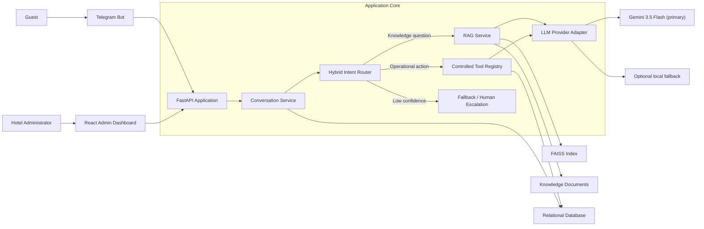

# ملحق ج - ميثاق المشروع وضبط النطاق

## 1. Document identity

| Field | Value |
|---|---|
| Arabic title | روبوت ذكي لدعم عملاء الفنادق باستخدام نماذج اللغة الكبيرة وتقنية استدعاء الأدوات |
| English title | AI Hotel Customer Support Bot Using Large Language Models and Tool Calling |
| Project owner | Anas Al-Najjar |
| Baseline | 0.1.0-draft |
| Current phase | Phase 1 — Requirements Analysis and System Design |
| Document date | 2026-07-13 |
| Baseline status | Proposed; requires owner approval |

## 2. Product vision

بناء مساعد فندقي ذكي ثنائي اللغة يجيب عن أسئلة النزلاء بالاستناد إلى معرفة الفندق، وينفذ عمليات فندقية محاكية بصورة مضبوطة وقابلة للتدقيق، ويقلل زمن استجابة موظفي الاستقبال من دون منح نموذج اللغة وصولاً مباشراً إلى قاعدة البيانات أو الأنظمة الخلفية.

القيمة التجارية المستقبلية هي تحويل المشروع إلى منتج B2B قابل للنشر داخل الفندق أو على خادم إقليمي منخفض التكلفة، مع تخصيص قاعدة المعرفة والهوية البصرية لكل فندق وبيع الاشتراك أو الترخيص السنوي وخدمة الإعداد.

## 3. Phase 1 deliverables

| Deliverable | Evidence | Gate status |
|---|---|---|
| Product scope and boundaries | This document, Sections 4–6 | Ready for review |
| Functional and non-functional requirements | `requirements-and-system-architecture.md` | Ready for review |
| Initial architecture and data design | `requirements-and-system-architecture.md` | Ready for review |
| Requirements traceability | `appendix-a-requirements-traceability-matrix.md` | Ready for review |
| Architecture decisions and open questions | `appendix-b-architecture-decisions.md` | Ready for review |

## 4. Scope baseline

### 4.1 In scope for the academic MVP

1. Telegram chat for Arabic and English guest conversations.
2. Guest intent detection with confidence and fallback behavior.
3. RAG answers grounded in an administrator-managed hotel knowledge base.
4. Simulated tools for booking lookup, room availability, room types, room-service requests, maintenance requests, and request-status lookup.
5. React administration dashboard for knowledge management and conversation monitoring.
6. Auditable storage of conversations, tool calls, service requests, and administrator actions.
7. Evaluation dataset and repeatable metrics for intent classification, retrieval, grounded answers, and tool execution.
8. Docker-based local deployment, with a provider abstraction for cloud or local LLMs.

### 4.2 Explicitly out of scope for the academic MVP

1. Real integration with a Property Management System (PMS), payment gateway, door locks, telephony, or production hotel infrastructure.
2. Real booking creation, cancellation, modification, refunds, or payment collection.
3. Voice calls, WhatsApp integration, and mobile applications.
4. Autonomous decisions involving money, guest identity, safety, compensation, or legal commitments.
5. Multi-hotel tenancy and commercial billing in the first academic release.
6. Training or fine-tuning a foundation model from scratch.

## 5. Actors

| Actor | Responsibilities |
|---|---|
| Guest | Asks questions, checks simulated booking/availability, creates and tracks service requests |
| Hotel administrator | Manages knowledge, monitors conversations, reviews requests, and views evaluation indicators |
| Reception/support employee | Receives escalated conversations and operational requests |
| LLM provider | Produces controlled natural-language output and structured tool proposals |
| System operator | Configures providers, deployment, backups, logs, and access policies |

## 6. Architecture baseline

The proposed system is a **modular monolith** with clear internal boundaries:

### Architectural rules

- The LLM never reads or writes the database directly.
- A model may propose a tool call; the backend validates authorization, schema, business rules, and idempotency before execution.
- Factual hotel answers must be grounded in retrieved knowledge or a deterministic tool result.
- Low-confidence or safety-sensitive requests must fall back or escalate instead of being guessed.
- Provider-specific LLM logic remains behind an adapter to tolerate access restrictions and control cost.
- LangChain may support adapters and orchestration, but core business rules must remain framework-independent.

## 7. Proposed quality gates

These are acceptance targets, not measured results:

| Area | Target before final defense |
|---|---|
| Intent classification | Macro F1 ≥ 0.85 on a held-out bilingual test set |
| Retrieval | Recall@5 ≥ 0.85 on curated hotel questions |
| Grounded FAQ answers | ≥ 90% judged correct and supported by retrieved context |
| Tool selection | ≥ 95% correct tool and valid arguments on the action test set |
| Tool execution | 100% deterministic pass rate for defined valid/invalid contract tests |
| Performance | P95 end-to-end response ≤ 10 seconds with the configured online provider; deterministic tools ≤ 2 seconds excluding Telegram/network latency |
| Security | No critical/high findings in the agreed security checklist; no secrets committed |
| Reliability | Clear user-facing fallback when LLM, embedding model, Telegram, or index is unavailable |

## 8. Delivery phases and gates

| Phase | Output | Exit gate |
|---|---|---|
| 1. Requirements and design | الوثيقة الرسمية وملاحقها | Scope, requirements, architecture, and open decisions approved |
| 2. Foundation and data | Backend skeleton, database, seed data, intent dataset, knowledge pipeline | Automated foundation tests pass |
| 3. AI and interfaces | RAG, tools, LLM adapter, Telegram, admin dashboard | End-to-end scenarios pass |
| 4. Evaluation and defense | Metrics, test report, thesis artifacts, presentation | Targets measured and limitations documented |

## 9. Commercialization path after the academic MVP

1. Package a single-hotel pilot with onboarding, knowledge import, branding, and staff training.
2. Sell through B2B direct contracts with monthly/annual invoicing, local bank arrangements, or agreed USDT settlement where lawful and operationally suitable; do not make payment rails part of the MVP.
3. Offer self-hosted or regional-VPS deployment for hotels that cannot rely on restricted global platforms.
4. Add multi-tenancy, WhatsApp, PMS integration, analytics, and service-level agreements only after a paid pilot validates demand.

## 10. Confirmed baseline decisions

1. MySQL 8 is the authoritative relational database.
2. Gemini API with live-verified model ID `gemini-2.5-flash` is the primary LLM provider.
3. The MVP represents one complete fictional hotel using coherent synthetic data.
4. Raw conversations are retained for 90 days, while Gemini receives only the latest five complete turns plus structured session state and request-specific evidence.
5. API secrets remain outside Git in a local `.env`; the repository contains placeholders only.

## 11. Remaining decisions before Phase 2

1. Whether an offline local LLM fallback is required for the academic demonstration.
2. React + Vite versus Next.js for the administration dashboard; React + Vite remains recommended.

## 12. Phase 1 approval record

| Role | Name | Decision | Date | Notes |
|---|---|---|---|---|
| Project owner | Anas Al-Najjar | Pending | — | — |
| Academic supervisor | — | Pending | — | — |
